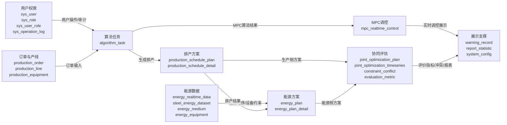

# 数据库设计报告

## 1.需求分析

本数据库面向工业园区轧钢生产与能源供给协同优化场景，支撑“后端模拟采集装置或外部采集程序按分钟写入能源数据，前端录入次日计划日期和订单产量，后端创建算法任务并调用Python工程化算法，最终生成排产方案、能源运行方案、MPC实时调控和协同评估结果”的完整业务链路。

| 需求类别      | 设计要求                                                     | 对应数据表                                                   |
| ------------- | ------------------------------------------------------------ | ------------------------------------------------------------ |
| 用户与权限    | 支持登录、角色识别、用户管理、操作审计；正式角色统一为ADMIN和USER。 | sys_user、sys_role、sys_user_role、sys_operation_log         |
| 订单与排产    | 保存前端录入的次日订单产量或订单CSV导入结果，按计划数量、交付截止时间、优先级参与日内小时级排产。 | production_order、production_schedule_plan、production_schedule_detail |
| 算法任务      | 记录异步算法任务状态、输入、输出、错误日志，保证任务可追踪和可复现。 | algorithm_task                                               |
| 能源数据      | 保存分钟级能源时序数据、钢铁能源样本、能源介质与设备约束。   | energy_realtime_data、steel_energy_dataset、energy_medium、energy_equipment |
| 能源方案与MPC | 保存后端派生能源运行方案、Python算法输出的MPC初始指令和后端滚动MPC修正指令。 | energy_plan、energy_plan_detail、mpc_realtime_control        |
| 协同评估      | 保存生产-能源协同优化结果、时序对比、冲突检测和评价指标。    | joint_optimization_plan、joint_optimization_timeseries、constraint_conflict、evaluation_metric |
| 展示与配置    | 支撑首页看板、告警、报表中心、运行参数配置。                 | warning_record、report_statistic、system_config              |

## 2. 数据来源与处理链路

| 数据来源           | 进入方式                                                   | 落库表                                                       | 说明                                                         |
| ------------------ | ---------------------------------------------------------- | ------------------------------------------------------------ | ------------------------------------------------------------ |
| 前端订单产量       | 前端调用 /api/production/schedules/generate-from-collected-data | production_order                                             | 后端自动写入或更新 `AUTO-计划日期` 订单；planned_quantity 为用户录入产量；due_time 默认为计划日 23:59:59。 |
| 订单CSV            | 前端上传 /api/production/orders/import                     | production_order                                             | 保留为批量订单导入/联调入口；order_no唯一去重；due_time为交付截止时间；status默认为PENDING（待排产）。 |
| 能源实时采集数据   | 后端模拟采集装置或外部程序调用 /api/energy/realtime/push  | energy_realtime_data                                         | 当前默认由 `MOCK_DEVICE` 启动时补齐最近7天分钟级数据，并每分钟新增一条；真实接入时由采集程序推送。 |
| 历史能源CSV        | 补录/联调用 /api/production/schedules/generate-from-raw-data | energy_realtime_data、steel_energy_dataset                   | 不再作为正式前端主流程，主要用于历史数据补录、算法联调和兜底测试。 |
| Python排产算法输出 | 后端执行 generate_plan.py input.csv output.json orders.csv | algorithm_task、production_schedule_plan、production_schedule_detail | daily_plan被拆解为主表和24小时明细。                         |
| Python MPC输出     | output.json中的realtime_control解析                        | mpc_realtime_control                                         | 保存方案生成时的锅炉负荷、汽机出力、外购电、功率因数目标等初始指令。 |
| 滚动MPC修正        | RealtimeMpcControlTask 每分钟读取最新采集数据和排产计划    | mpc_realtime_control                                         | 保存分钟级反馈修正指令，形成计划-执行-反馈-修正闭环。        |
| 后端派生结果       | 服务层根据排产方案、价格策略和约束规则计算                 | energy_plan、energy_plan_detail、joint_optimization_plan、evaluation_metric | 用于能源方案、协同评估、报表展示。                           |
| 系统运行数据       | 登录、配置、告警、日志等业务操作写入                       | sys_operation_log、warning_record、system_config、report_statistic | 支撑系统管理和展示。                                         |

## 3. E-R图与关系设计

系统采用“逻辑外键 + 唯一键/普通索引 + 业务代码校验”的关系维护方式。当前建表SQL未启用物理FOREIGN KEY，主要考虑演示数据重置、算法任务异步写入和联调导入的灵活性；报告中关系均为逻辑关系。

| 父级字段                    | 子级字段                                  | 关系说明                 |
| --------------------------- | ----------------------------------------- | ------------------------ |
| sys_user.id                 | sys_user_role.user_id                     | 用户与角色关联           |
| sys_role.id                 | sys_user_role.role_id                     | 角色授权关系             |
| sys_user.id                 | sys_operation_log.user_id                 | 操作日志记录操作人       |
| production_line.id          | production_equipment.line_id              | 产线包含生产设备         |
| algorithm_task.id           | production_schedule_plan.task_id          | 算法任务生成排产方案     |
| production_schedule_plan.id | production_schedule_detail.schedule_id    | 排产主表与24小时明细     |
| production_order.id         | production_schedule_detail.order_id       | 订单与排产明细的预留关联 |
| production_schedule_plan.id | energy_plan.source_schedule_id            | 排产方案派生能源方案     |
| algorithm_task.id           | energy_plan.task_id                       | 能源方案生成任务         |
| energy_plan.id              | energy_plan_detail.plan_id                | 能源方案主表与明细       |
| production_schedule_plan.id | joint_optimization_plan.schedule_id       | 协同评估关联排产方案     |
| energy_plan.id              | joint_optimization_plan.energy_plan_id    | 协同评估关联能源方案     |
| joint_optimization_plan.id  | joint_optimization_timeseries.optimize_id | 协同评估时序明细         |
| joint_optimization_plan.id  | constraint_conflict.optimize_id           | 协同评估约束冲突         |
| algorithm_task.id           | mpc_realtime_control.task_id              | 算法任务生成MPC调控记录  |

## 4.核心表设计

### 4.1系统权限表

| 表名              | 用途           | 数据来源                                          |
| ----------------- | -------------- | ------------------------------------------------- |
| sys_user          | 用户表         | 系统初始化与管理员维护                            |
| sys_role          | 角色表         | 系统初始化与管理员维护；正式角色统一为ADMIN、USER |
| sys_user_role     | 用户角色关联表 | 用户与角色授权关系                                |
| sys_operation_log | 操作日志表     | 后端操作日志切面自动写入                          |

### sys_user（用户表）

| 字段名          | 字段类型     | 约束/默认值                                                  | 字段含义                   |
| --------------- | ------------ | ------------------------------------------------------------ | -------------------------- |
| id              | BIGINT       | PK; NULL                                                     | 用户ID                     |
| username        | VARCHAR(64)  | NOT NULL                                                     | 登录账号                   |
| password        | VARCHAR(255) | NOT NULL                                                     | 加密密码                   |
| real_name       | VARCHAR(64)  | NULL                                                         | 姓名                       |
| phone           | VARCHAR(32)  | NULL                                                         | 手机号                     |
| email           | VARCHAR(128) | NULL                                                         | 邮箱                       |
| status          | VARCHAR(32)  | NOT NULL; DEFAULT 'ENABLE'                                   | ENABLE/DISABLE             |
| last_login_time | DATETIME     | NULL                                                         | 最近登录时间               |
| create_time     | DATETIME     | NOT NULL; DEFAULT CURRENT_TIMESTAMP                          | 创建时间                   |
| update_time     | DATETIME     | NOT NULL; DEFAULT CURRENT_TIMESTAMP ON UPDATE CURRENT_TIMESTAMP | 更新时间                   |
| create_by       | BIGINT       | NULL                                                         | 创建人ID                   |
| update_by       | BIGINT       | NULL                                                         | 更新人ID                   |
| deleted         | TINYINT      | NOT NULL; DEFAULT 0                                          | 逻辑删除：0未删除，1已删除 |
| remark          | VARCHAR(500) | NULL                                                         | 备注                       |

### sys_role（角色表）

| 字段名      | 字段类型     | 约束/默认值                                                  | 字段含义 |
| ----------- | ------------ | ------------------------------------------------------------ | -------- |
| id          | BIGINT       | PK; NULL                                                     | 角色ID   |
| role_code   | VARCHAR(64)  | NOT NULL                                                     | 角色编码 |
| role_name   | VARCHAR(64)  | NOT NULL                                                     | 角色名称 |
| status      | VARCHAR(32)  | NOT NULL; DEFAULT 'ENABLE'                                   | 启用状态 |
| create_time | DATETIME     | NOT NULL; DEFAULT CURRENT_TIMESTAMP                          | 创建时间 |
| update_time | DATETIME     | NOT NULL; DEFAULT CURRENT_TIMESTAMP ON UPDATE CURRENT_TIMESTAMP | 更新时间 |
| create_by   | BIGINT       | NULL                                                         | 创建人ID |
| update_by   | BIGINT       | NULL                                                         | 更新人ID |
| deleted     | TINYINT      | NOT NULL; DEFAULT 0                                          | 逻辑删除 |
| remark      | VARCHAR(500) | NULL                                                         | 备注     |

### sys_user_role（用户角色关联表）

| 字段名  | 字段类型 | 约束/默认值 | 字段含义 |
| ------- | -------- | ----------- | -------- |
| id      | BIGINT   | PK; NULL    | 主键     |
| user_id | BIGINT   | NOT NULL    | 用户ID   |
| role_id | BIGINT   | NOT NULL    | 角色ID   |

### sys_operation_log（操作日志表）

| 字段名         | 字段类型      | 约束/默认值                         | 字段含义 |
| -------------- | ------------- | ----------------------------------- | -------- |
| id             | BIGINT        | PK; NULL                            | 主键     |
| user_id        | BIGINT        | NULL                                | 操作人   |
| module         | VARCHAR(64)   | NULL                                | 模块     |
| operation      | VARCHAR(128)  | NULL                                | 操作名称 |
| request_uri    | VARCHAR(255)  | NULL                                | 请求地址 |
| request_method | VARCHAR(16)   | NULL                                | 请求方式 |
| request_param  | LONGTEXT      | NULL                                | 请求参数 |
| result_code    | INT           | NULL                                | 响应码   |
| error_message  | VARCHAR(1000) | NULL                                | 错误信息 |
| operation_time | DATETIME      | NOT NULL; DEFAULT CURRENT_TIMESTAMP | 操作时间 |

### 4.2生产排产

| 表名                       | 用途           | 数据来源                                                     |
| -------------------------- | -------------- | ------------------------------------------------------------ |
| production_line            | 产线表         | 联调基础数据/产线基础配置                                    |
| production_equipment       | 生产设备表     | 联调基础数据/产线设备配置                                    |
| production_order           | 生产订单表     | 前端录入订单产量自动写入 `AUTO-计划日期` 订单；也支持订单CSV导入；order_no用于去重更新 |
| algorithm_task             | 算法任务表     | 后端创建算法任务并记录前端请求、算法请求、算法响应与异常日志 |
| production_schedule_plan   | 排产方案主表   | 后端调用Python算法生成daily_plan后解析入库                   |
| production_schedule_detail | 排产方案明细表 | 后端拆解daily_plan小时级排产结果；部分展示字段由后端补齐     |

### production_line（产线表）

| 字段名       | 字段类型      | 约束/默认值                                                  | 字段含义          |
| ------------ | ------------- | ------------------------------------------------------------ | ----------------- |
| id           | BIGINT        | PK; NULL                                                     | 产线ID            |
| line_code    | VARCHAR(64)   | NOT NULL                                                     | 产线编码          |
| line_name    | VARCHAR(128)  | NOT NULL                                                     | 产线名称          |
| max_capacity | DECIMAL(12,2) | NULL                                                         | 最大产能，t/h     |
| min_capacity | DECIMAL(12,2) | NULL                                                         | 最小产能，t/h     |
| status       | VARCHAR(32)   | NOT NULL; DEFAULT 'AVAILABLE'                                | AVAILABLE/STOPPED |
| create_time  | DATETIME      | NOT NULL; DEFAULT CURRENT_TIMESTAMP                          | 创建时间          |
| update_time  | DATETIME      | NOT NULL; DEFAULT CURRENT_TIMESTAMP ON UPDATE CURRENT_TIMESTAMP | 更新时间          |
| create_by    | BIGINT        | NULL                                                         |                   |
| update_by    | BIGINT        | NULL                                                         |                   |
| deleted      | TINYINT       | NOT NULL; DEFAULT 0                                          |                   |
| remark       | VARCHAR(500)  | NULL                                                         |                   |

### production_equipment（生产设备表）

| 字段名         | 字段类型      | 约束/默认值                                                  | 字段含义                      |
| -------------- | ------------- | ------------------------------------------------------------ | ----------------------------- |
| id             | BIGINT        | PK; NULL                                                     | 设备ID                        |
| line_id        | BIGINT        | NOT NULL                                                     | 所属产线                      |
| equipment_code | VARCHAR(64)   | NOT NULL                                                     | 设备编码                      |
| equipment_name | VARCHAR(128)  | NOT NULL                                                     | 设备名称                      |
| equipment_type | VARCHAR(64)   | NULL                                                         | 设备类型                      |
| rated_power    | DECIMAL(12,2) | NULL                                                         | 额定功率，kW                  |
| status         | VARCHAR(32)   | NOT NULL; DEFAULT 'AVAILABLE'                                | AVAILABLE/STOPPED/MAINTAINING |
| create_time    | DATETIME      | NOT NULL; DEFAULT CURRENT_TIMESTAMP                          |                               |
| update_time    | DATETIME      | NOT NULL; DEFAULT CURRENT_TIMESTAMP ON UPDATE CURRENT_TIMESTAMP |                               |
| create_by      | BIGINT        | NULL                                                         |                               |
| update_by      | BIGINT        | NULL                                                         |                               |
| deleted        | TINYINT       | NOT NULL; DEFAULT 0                                          |                               |
| remark         | VARCHAR(500)  | NULL                                                         |                               |

### production_order（生产订单表）

| 字段名           | 字段类型      | 约束/默认值                                                  | 字段含义               |
| ---------------- | ------------- | ------------------------------------------------------------ | ---------------------- |
| id               | BIGINT        | PK; NULL                                                     | 订单ID                 |
| order_no         | VARCHAR(64)   | NOT NULL                                                     | 订单编号               |
| product_name     | VARCHAR(128)  | NOT NULL                                                     | 产品名称               |
| product_spec     | VARCHAR(128)  | NULL                                                         | 产品规格               |
| planned_quantity | DECIMAL(12,2) | NOT NULL                                                     | 计划数量，t            |
| unit             | VARCHAR(16)   | NOT NULL; DEFAULT 't'                                        | 单位                   |
| due_time         | DATETIME      | NOT NULL                                                     | 交付时间               |
| priority         | INT           | NOT NULL; DEFAULT 1                                          | 优先级，数值越小越优先 |
| status           | VARCHAR(32)   | NOT NULL; DEFAULT 'PENDING'                                  | 订单状态               |
| create_time      | DATETIME      | NOT NULL; DEFAULT CURRENT_TIMESTAMP                          |                        |
| update_time      | DATETIME      | NOT NULL; DEFAULT CURRENT_TIMESTAMP ON UPDATE CURRENT_TIMESTAMP |                        |
| create_by        | BIGINT        | NULL                                                         |                        |
| update_by        | BIGINT        | NULL                                                         |                        |
| deleted          | TINYINT       | NOT NULL; DEFAULT 0                                          |                        |
| remark           | VARCHAR(500)  | NULL                                                         |                        |

### algorithm_task（算法任务表）

| 字段名                  | 字段类型      | 约束/默认值                                                  | 字段含义                                                     |
| ----------------------- | ------------- | ------------------------------------------------------------ | ------------------------------------------------------------ |
| id                      | BIGINT        | PK; NULL                                                     | 任务ID，对应taskId                                           |
| task_type               | VARCHAR(64)   | NOT NULL                                                     | PRODUCTION_SCHEDULE/ENERGY_PLAN/JOINT_OPTIMIZATION/REALTIME_CONTROL/REALTIME_MPC |
| status                  | VARCHAR(32)   | NOT NULL; DEFAULT 'PENDING'                                  | PENDING/RUNNING/SUCCESS/FAILED/CANCELED                      |
| progress                | INT           | NULL                                                         | 进度0-100                                                    |
| result_id               | BIGINT        | NULL                                                         | 结果主键                                                     |
| message                 | VARCHAR(500)  | NULL                                                         | 状态说明                                                     |
| error_message           | VARCHAR(1000) | NULL                                                         | 失败原因                                                     |
| retry_count             | INT           | NOT NULL; DEFAULT 0                                          | 重试次数                                                     |
| algorithm_name          | VARCHAR(128)  | NULL                                                         | 算法名称，如DAILY_MILP_SCHEDULE                              |
| algorithm_version       | VARCHAR(64)   | NULL                                                         | 算法版本                                                     |
| result_file_name        | VARCHAR(255)  | NULL                                                         | 算法结果文件名，如daily_plan.json                            |
| training_record_count   | INT           | NULL                                                         | 训练/拟合记录数，如132481                                    |
| frontend_request_json   | LONGTEXT      | NULL                                                         | 前端请求原始JSON                                             |
| algorithm_request_json  | LONGTEXT      | NULL                                                         | 后端传给算法原始JSON                                         |
| algorithm_response_json | LONGTEXT      | NULL                                                         | 算法返回原始JSON                                             |
| start_time              | DATETIME      | NULL                                                         | 任务开始时间                                                 |
| finish_time             | DATETIME      | NULL                                                         | 任务结束时间                                                 |
| create_time             | DATETIME      | NOT NULL; DEFAULT CURRENT_TIMESTAMP                          |                                                              |
| update_time             | DATETIME      | NOT NULL; DEFAULT CURRENT_TIMESTAMP ON UPDATE CURRENT_TIMESTAMP |                                                              |
| create_by               | BIGINT        | NULL                                                         |                                                              |
| update_by               | BIGINT        | NULL                                                         |                                                              |
| deleted                 | TINYINT       | NOT NULL; DEFAULT 0                                          |                                                              |
| remark                  | VARCHAR(500)  | NULL                                                         |                                                              |

### production_schedule_plan（排产方案主表）

| 字段名              | 字段类型      | 约束/默认值                                                  | 字段含义                               |
| ------------------- | ------------- | ------------------------------------------------------------ | -------------------------------------- |
| id                  | BIGINT        | PK; NULL                                                     | 排产方案ID                             |
| task_id             | BIGINT        | NOT NULL                                                     | 对应算法任务ID                         |
| schedule_name       | VARCHAR(128)  | NOT NULL                                                     | 方案名称                               |
| schedule_date       | DATE          | NOT NULL                                                     | 排产日期                               |
| plan_start_time     | DATETIME      | NOT NULL                                                     | 计划开始时间，对应daily_plan.timestamp |
| plan_horizon        | INT           | NOT NULL                                                     | 计划跨度，当前为24                     |
| plan_unit           | VARCHAR(32)   | NOT NULL; DEFAULT 'hour'                                     | 计划单位                               |
| data_granularity    | VARCHAR(32)   | NOT NULL; DEFAULT '1                                         | 模型底层数据粒度                       |
| status              | VARCHAR(32)   | NOT NULL; DEFAULT 'SUCCESS'                                  | 方案状态                               |
| objective           | VARCHAR(64)   | NULL                                                         | 优化目标                               |
| elec_coefficient    | DECIMAL(12,4) | NULL                                                         | 电耗系数，kWh/吨，旧版算法使用         |
| ec_baseline         | DECIMAL(12,4) | NULL                                                         | 优化前EC基准值，kWh/吨                 |
| ec_optimized        | DECIMAL(12,4) | NULL                                                         | 优化后EC值，kWh/吨                     |
| ec_reduction        | DECIMAL(12,4) | NULL                                                         | EC降低百分比                           |
| optimal_temperature | DECIMAL(12,4) | NULL                                                         | 最优温度，℃                            |
| optimal_speed       | DECIMAL(12,4) | NULL                                                         | 最优速度                               |
| total_demand        | DECIMAL(14,6) | NULL                                                         | 总需求                                 |
| total_production    | DECIMAL(14,6) | NULL                                                         | 总排产量                               |
| total_energy        | DECIMAL(14,6) | NULL                                                         | 总预测电耗，kWh                        |
| raw_plan_json       | LONGTEXT      | NULL                                                         | daily_plan.json原文                    |
| create_time         | DATETIME      | NOT NULL; DEFAULT CURRENT_TIMESTAMP                          |                                        |
| update_time         | DATETIME      | NOT NULL; DEFAULT CURRENT_TIMESTAMP ON UPDATE CURRENT_TIMESTAMP |                                        |
| create_by           | BIGINT        | NULL                                                         |                                        |
| update_by           | BIGINT        | NULL                                                         |                                        |
| deleted             | TINYINT       | NOT NULL; DEFAULT 0                                          |                                        |
| remark              | VARCHAR(500)  | NULL                                                         |                                        |

### production_schedule_detail（排产方案明细表）

| 字段名              | 字段类型      | 约束/默认值         | 字段含义               |
| ------------------- | ------------- | ------------------- | ---------------------- |
| id                  | BIGINT        | PK; NULL            | 明细ID                 |
| schedule_id         | BIGINT        | NOT NULL            | 排产方案ID             |
| hour_index          | INT           | NOT NULL            | 小时序号，0-23         |
| start_time          | DATETIME      | NOT NULL            | 小时开始时间           |
| end_time            | DATETIME      | NOT NULL            | 小时结束时间           |
| demand              | DECIMAL(14,6) | NULL                | 小时需求               |
| production          | DECIMAL(14,6) | NOT NULL            | 小时排产量，吨         |
| elec_forecast       | DECIMAL(14,6) | NOT NULL            | 小时预测电耗，kWh      |
| line_id             | BIGINT        | NULL                | 产线ID，当前JSON未提供 |
| equipment_id        | BIGINT        | NULL                | 设备ID，当前JSON未提供 |
| order_id            | BIGINT        | NULL                | 订单ID，当前JSON未提供 |
| equipment_load_rate | DECIMAL(8,2)  | NULL                | 设备负荷率             |
| conflict_flag       | TINYINT       | NOT NULL; DEFAULT 0 | 是否存在冲突           |

### 4.3能源数据与能源方案

| 表名                      | 用途               | 数据来源                                             |
| ------------------------- | ------------------ | ---------------------------------------------------- |
| energy_medium             | 能源介质表         | 能源介质基础配置                                     |
| energy_equipment          | 能源设备表         | 能源设备基础配置，约束范围与算法报告保持一致         |
| energy_realtime_data      | 能源实时数据表     | 模拟采集装置或外部采集程序按分钟写入；历史能源CSV和seed作为补录/兜底数据 |
| steel_energy_dataset      | 钢铁能源样本表     | 历史能源CSV或样本钢铁能源时序数据转换，用于算法联调和分析兜底 |
| energy_production_history | 生产能源历史表     | 生产-能源历史融合预留表                              |
| energy_plan               | 能源运行方案主表   | 后端基于排产方案、价格策略和约束规则派生能源运行方案 |
| energy_plan_detail        | 能源运行方案明细表 | 能源运行方案时序明细                                 |

### energy_medium（能源介质表）

| 字段名               | 字段类型      | 约束/默认值                                                  | 字段含义          |
| -------------------- | ------------- | ------------------------------------------------------------ | ----------------- |
| id                   | BIGINT        | PK; NULL                                                     | 介质ID            |
| medium_code          | VARCHAR(64)   | NOT NULL                                                     | ELECTRICITY/STEAM |
| medium_name          | VARCHAR(64)   | NOT NULL                                                     | 介质名称          |
| unit                 | VARCHAR(32)   | NOT NULL                                                     | 单位              |
| standard_coal_factor | DECIMAL(12,6) | NULL                                                         | 折标煤系数        |
| create_time          | DATETIME      | NOT NULL; DEFAULT CURRENT_TIMESTAMP                          |                   |
| update_time          | DATETIME      | NOT NULL; DEFAULT CURRENT_TIMESTAMP ON UPDATE CURRENT_TIMESTAMP |                   |
| create_by            | BIGINT        | NULL                                                         |                   |
| update_by            | BIGINT        | NULL                                                         |                   |
| deleted              | TINYINT       | NOT NULL; DEFAULT 0                                          |                   |
| remark               | VARCHAR(500)  | NULL                                                         |                   |

### energy_equipment（能源设备表）

| 字段名         | 字段类型      | 约束/默认值                                                  | 字段含义           |
| -------------- | ------------- | ------------------------------------------------------------ | ------------------ |
| id             | BIGINT        | PK; NULL                                                     | 设备ID             |
| equipment_code | VARCHAR(64)   | NOT NULL                                                     | 设备编码           |
| equipment_name | VARCHAR(128)  | NOT NULL                                                     | 设备名称           |
| equipment_type | VARCHAR(64)   | NOT NULL                                                     | 设备类型，如BOILER |
| min_output     | DECIMAL(12,2) | NULL                                                         | 最小输出           |
| max_output     | DECIMAL(12,2) | NULL                                                         | 最大输出           |
| efficiency     | DECIMAL(8,4)  | NULL                                                         | 效率               |
| status         | VARCHAR(32)   | NOT NULL; DEFAULT 'AVAILABLE'                                | 设备状态           |
| create_time    | DATETIME      | NOT NULL; DEFAULT CURRENT_TIMESTAMP                          |                    |
| update_time    | DATETIME      | NOT NULL; DEFAULT CURRENT_TIMESTAMP ON UPDATE CURRENT_TIMESTAMP |                    |
| create_by      | BIGINT        | NULL                                                         |                    |
| update_by      | BIGINT        | NULL                                                         |                    |
| deleted        | TINYINT       | NOT NULL; DEFAULT 0                                          |                    |
| remark         | VARCHAR(500)  | NULL                                                         |                    |

### energy_realtime_data（能源实时数据表）

| 字段名                       | 字段类型      | 约束/默认值                        | 字段含义                      |
| ---------------------------- | ------------- | ---------------------------------- | ----------------------------- |
| id                           | BIGINT        | PK; NULL                           | 主键                          |
| timestamp                    | DATETIME      | NOT NULL                           | 清洗后的采集时间              |
| raw_timestamp                | VARCHAR(64)   | NULL                               | 原始时间文本                  |
| electricity_consumption      | DECIMAL(14,4) | NOT NULL                           | 源字段elec，15分钟用电量，kWh |
| steam_consumption            | DECIMAL(14,4) | NULL                               | 源字段steam，单位待确认       |
| carbon_emission_tco2         | DECIMAL(14,6) | NULL                               | 源字段CO2_tCO2_，tCO2         |
| lagging_reactive_power_kvarh | DECIMAL(14,4) | NULL                               | 滞后无功电量                  |
| leading_reactive_power_kvarh | DECIMAL(14,4) | NULL                               | 超前无功电量                  |
| lagging_power_factor         | DECIMAL(8,4)  | NULL                               | 滞后功率因数                  |
| leading_power_factor         | DECIMAL(8,4)  | NULL                               | 超前功率因数                  |
| nsm                          | INT           | NULL                               | 日内秒数                      |
| week_status                  | VARCHAR(32)   | NULL                               | 工作日/周末                   |
| day_of_week                  | VARCHAR(32)   | NULL                               | 星期                          |
| load_type                    | VARCHAR(64)   | NULL                               | 负荷类型                      |
| data_quality                 | VARCHAR(32)   | NULL                               | NORMAL/MISSING/ABNORMAL       |
| source                       | VARCHAR(128)  | NULL; DEFAULT 'steel_data_cleaned' | 数据来源                      |

### steel_energy_dataset（钢铁能源样本表）

| 字段名                       | 字段类型      | 约束/默认值 | 字段含义              |
| ---------------------------- | ------------- | ----------- | --------------------- |
| id                           | BIGINT        | PK; NULL    | 主键                  |
| timestamp                    | DATETIME      | NOT NULL    | 清洗后的时间          |
| raw_timestamp                | VARCHAR(64)   | NULL        | 原始时间文本          |
| electricity_consumption      | DECIMAL(14,4) | NOT NULL    | elec，用电量kWh       |
| lagging_reactive_power_kvarh | DECIMAL(14,4) | NULL        | 滞后无功电量          |
| leading_reactive_power_kvarh | DECIMAL(14,4) | NULL        | 超前无功电量          |
| carbon_emission_tco2         | DECIMAL(14,6) | NULL        | 碳排放tCO2            |
| lagging_power_factor         | DECIMAL(8,4)  | NULL        | 滞后功率因数          |
| leading_power_factor         | DECIMAL(8,4)  | NULL        | 超前功率因数          |
| nsm                          | INT           | NULL        | 日内秒数              |
| week_status                  | VARCHAR(32)   | NULL        | 工作日/周末           |
| day_of_week                  | VARCHAR(32)   | NULL        | 星期                  |
| load_type                    | VARCHAR(64)   | NULL        | 负荷类型              |
| steam_consumption            | DECIMAL(14,4) | NULL        | steam，单位待确认     |
| data_quality                 | VARCHAR(32)   | NULL        | 数据质量/导入批次标识 |

### energy_production_history（生产能源历史表）

| 字段名                  | 字段类型      | 约束/默认值 | 字段含义                     |
| ----------------------- | ------------- | ----------- | ---------------------------- |
| id                      | BIGINT        | PK; NULL    | 主键                         |
| timestamp               | DATETIME      | NOT NULL    | 时间，建议按15分钟对齐       |
| steel_output            | DECIMAL(14,2) | NULL        | 轧钢产量，当前数据集缺失     |
| qualified_output        | DECIMAL(14,2) | NULL        | 合格产品产量，当前数据集缺失 |
| electricity_consumption | DECIMAL(14,4) | NOT NULL    | 用电量，kWh                  |
| steam_consumption       | DECIMAL(14,4) | NULL        | 蒸汽用量，单位待确认         |
| carbon_emission_tco2    | DECIMAL(14,6) | NULL        | 碳排放，tCO2                 |
| energy_cost             | DECIMAL(14,2) | NULL        | 能源成本，派生字段           |
| load_type               | VARCHAR(64)   | NULL        | 负荷类型                     |
| data_quality            | VARCHAR(32)   | NULL        | 数据质量                     |

### energy_plan（能源运行方案主表）

| 字段名              | 字段类型      | 约束/默认值                                                  | 字段含义                                 |
| ------------------- | ------------- | ------------------------------------------------------------ | ---------------------------------------- |
| id                  | BIGINT        | PK; NULL                                                     | 能源方案ID                               |
| task_id             | BIGINT        | NOT NULL                                                     | 对应算法任务ID                           |
| source_schedule_id  | BIGINT        | NULL                                                         | 来源排产方案ID，用于自动生成链路幂等判断 |
| plan_date           | DATE          | NOT NULL                                                     | 方案日期                                 |
| status              | VARCHAR(32)   | NOT NULL; DEFAULT 'SUCCESS'                                  | 方案状态                                 |
| objective           | VARCHAR(64)   | NULL                                                         | 优化目标                                 |
| electric_price_mode | VARCHAR(64)   | NULL                                                         | 电价模式                                 |
| time_interval       | INT           | NOT NULL; DEFAULT 15                                         | 时间粒度，min                            |
| electricity_cost    | DECIMAL(14,2) | NULL                                                         | 电力成本                                 |
| steam_cost          | DECIMAL(14,2) | NULL                                                         | 蒸汽成本                                 |
| total_energy_cost   | DECIMAL(14,2) | NULL                                                         | 总能源成本                               |
| create_time         | DATETIME      | NOT NULL; DEFAULT CURRENT_TIMESTAMP                          |                                          |
| update_time         | DATETIME      | NOT NULL; DEFAULT CURRENT_TIMESTAMP ON UPDATE CURRENT_TIMESTAMP |                                          |
| create_by           | BIGINT        | NULL                                                         |                                          |
| update_by           | BIGINT        | NULL                                                         |                                          |
| deleted             | TINYINT       | NOT NULL; DEFAULT 0                                          |                                          |
| remark              | VARCHAR(500)  | NULL                                                         |                                          |

### energy_plan_detail（能源运行方案明细表）

| 字段名                  | 字段类型      | 约束/默认值 | 字段含义             |
| ----------------------- | ------------- | ----------- | -------------------- |
| id                      | BIGINT        | PK; NULL    | 明细ID               |
| plan_id                 | BIGINT        | NOT NULL    | 能源方案ID           |
| timestamp               | DATETIME      | NOT NULL    | 时间点               |
| equipment_id            | BIGINT        | NULL        | 能源设备ID           |
| output                  | DECIMAL(14,2) | NULL        | 设备输出             |
| electricity_consumption | DECIMAL(14,4) | NULL        | 用电量，kWh          |
| steam_consumption       | DECIMAL(14,4) | NULL        | 蒸汽用量，单位待确认 |
| carbon_emission_tco2    | DECIMAL(14,6) | NULL        | 碳排放，tCO2         |
| energy_cost             | DECIMAL(14,2) | NULL        | 能源成本             |

### 4.4协同评估与实时调控

| 表名                          | 用途               | 数据来源                                   |
| ----------------------------- | ------------------ | ------------------------------------------ |
| joint_optimization_plan       | 协同优化方案主表   | 后端基于排产方案与能源方案生成协同评估结果 |
| joint_optimization_timeseries | 协同优化时序明细表 | 协同评估时序明细                           |
| constraint_conflict           | 约束冲突记录表     | 协同评估过程中的约束冲突记录               |
| evaluation_metric             | 评价指标记录表     | MAPE、EC降低率、ER、降本、碳减排等评价指标 |
| mpc_realtime_control          | MPC实时调控结果表  | Python算法MPC初始指令 + 后端滚动MPC分钟级修正结果 |

### joint_optimization_plan（协同优化方案主表）

| 字段名                | 字段类型      | 约束/默认值                                                  | 字段含义         |
| --------------------- | ------------- | ------------------------------------------------------------ | ---------------- |
| id                    | BIGINT        | PK; NULL                                                     | 协同优化方案ID   |
| task_id               | BIGINT        | NOT NULL                                                     | 对应算法任务ID   |
| schedule_id           | BIGINT        | NOT NULL                                                     | 排产方案ID       |
| energy_plan_id        | BIGINT        | NOT NULL                                                     | 能源方案ID       |
| status                | VARCHAR(32)   | NOT NULL; DEFAULT 'SUCCESS'                                  | 方案状态         |
| recommended           | TINYINT       | NOT NULL; DEFAULT 0                                          | 是否推荐方案     |
| cost_reduction_rate   | DECIMAL(8,2)  | NULL                                                         | 降本率，%        |
| energy_reduction_rate | DECIMAL(8,2)  | NULL                                                         | 降耗率，%        |
| execute_rate          | DECIMAL(8,2)  | NULL                                                         | 可执行率，%      |
| mape                  | DECIMAL(8,2)  | NULL                                                         | MAPE，%          |
| ec                    | DECIMAL(12,4) | NULL                                                         | 单位合格产品能耗 |
| er                    | DECIMAL(8,2)  | NULL                                                         | 方案可执行率，%  |
| create_time           | DATETIME      | NOT NULL; DEFAULT CURRENT_TIMESTAMP                          |                  |
| update_time           | DATETIME      | NOT NULL; DEFAULT CURRENT_TIMESTAMP ON UPDATE CURRENT_TIMESTAMP |                  |
| create_by             | BIGINT        | NULL                                                         |                  |
| update_by             | BIGINT        | NULL                                                         |                  |
| deleted               | TINYINT       | NOT NULL; DEFAULT 0                                          |                  |
| remark                | VARCHAR(500)  | NULL                                                         |                  |

### joint_optimization_timeseries（协同优化时序明细表）

| 字段名                  | 字段类型      | 约束/默认值 | 字段含义             |
| ----------------------- | ------------- | ----------- | -------------------- |
| id                      | BIGINT        | PK; NULL    | 明细ID               |
| optimize_id             | BIGINT        | NOT NULL    | 协同优化方案ID       |
| timestamp               | DATETIME      | NOT NULL    | 时间点               |
| planned_output          | DECIMAL(14,2) | NULL        | 计划产量，t          |
| electricity_consumption | DECIMAL(14,4) | NULL        | 用电量，kWh          |
| steam_consumption       | DECIMAL(14,4) | NULL        | 蒸汽用量，单位待确认 |
| carbon_emission_tco2    | DECIMAL(14,6) | NULL        | 碳排放，tCO2         |
| energy_cost             | DECIMAL(14,2) | NULL        | 能源成本             |

### constraint_conflict（约束冲突记录表）

| 字段名        | 字段类型      | 约束/默认值         | 字段含义       |
| ------------- | ------------- | ------------------- | -------------- |
| id            | BIGINT        | PK; NULL            | 冲突ID         |
| optimize_id   | BIGINT        | NOT NULL            | 协同优化方案ID |
| conflict_type | VARCHAR(64)   | NOT NULL            | 冲突类型       |
| start_time    | DATETIME      | NOT NULL            | 开始时间       |
| end_time      | DATETIME      | NOT NULL            | 结束时间       |
| description   | VARCHAR(1000) | NULL                | 冲突说明       |
| resolved      | TINYINT       | NOT NULL; DEFAULT 0 | 是否解决       |

### evaluation_metric（评价指标记录表）

| 字段名           | 字段类型      | 约束/默认值                         | 字段含义              |
| ---------------- | ------------- | ----------------------------------- | --------------------- |
| id               | BIGINT        | PK; NULL                            | 指标ID                |
| biz_type         | VARCHAR(64)   | NOT NULL                            | SCHEDULE/ENERGY/JOINT |
| biz_id           | BIGINT        | NOT NULL                            | 业务主键              |
| mape             | DECIMAL(8,2)  | NULL                                | MAPE，%               |
| ec_before        | DECIMAL(12,4) | NULL                                | 优化前EC              |
| ec_after         | DECIMAL(12,4) | NULL                                | 优化后EC              |
| er               | DECIMAL(8,2)  | NULL                                | ER，%                 |
| cost_saving      | DECIMAL(14,2) | NULL                                | 降本金额，元          |
| carbon_reduction | DECIMAL(14,6) | NULL                                | 碳减排，tCO2          |
| calculate_time   | DATETIME      | NOT NULL; DEFAULT CURRENT_TIMESTAMP | 指标计算时间          |

### mpc_realtime_control（MPC实时调控结果表）

| 字段名              | 字段类型      | 约束/默认值                         | 字段含义                                 |
| ------------------- | ------------- | ----------------------------------- | ---------------------------------------- |
| id                  | BIGINT        | PK; NULL                            | 控制记录ID                               |
| task_id             | BIGINT        | NULL                                | 对应算法任务ID，可为空                   |
| control_date        | DATE          | NOT NULL                            | 控制日期，由后端按入库日期或业务日期填充 |
| control_time        | TIME          | NOT NULL                            | 控制时间，对应timestamp，格式HH:mm:ss    |
| raw_timestamp       | VARCHAR(32)   | NOT NULL                            | 原始时间字符串                           |
| boiler_load_mw      | DECIMAL(14,6) | NOT NULL                            | 锅炉负荷指令，MW                         |
| turbine_output_mw   | DECIMAL(14,6) | NOT NULL                            | 汽机出力指令，MW                         |
| grid_purchase_kwh   | DECIMAL(14,6) | NOT NULL                            | 外购电力指令，kWh                        |
| power_factor_target | DECIMAL(8,6)  | NOT NULL                            | 功率因数目标值                           |
| elec_next_5min_kwh  | DECIMAL(14,6) | NOT NULL                            | 未来5分钟用电预测，kWh                   |
| steam_next_5min_t   | DECIMAL(14,6) | NOT NULL                            | 未来5分钟蒸汽预测，吨                    |
| source_file_name    | VARCHAR(255)  | NULL                                | 来源文件名，如realtime_control.json      |
| raw_json            | LONGTEXT      | NULL                                | 原始JSON                                 |
| create_time         | DATETIME      | NOT NULL; DEFAULT CURRENT_TIMESTAMP | 入库时间                                 |

### 4.5告警、报表与配置

| 表名             | 用途       | 数据来源                           |
| ---------------- | ---------- | ---------------------------------- |
| warning_record   | 告警记录表 | 系统告警与演示告警数据             |
| system_config    | 系统配置表 | 系统运行参数、采集配置、班次配置等 |
| report_statistic | 报表统计表 | 报表中心按日期和类型汇总的统计数据 |

### warning_record（告警记录表）

| 字段名       | 字段类型      | 约束/默认值         | 字段含义        |
| ------------ | ------------- | ------------------- | --------------- |
| id           | BIGINT        | PK; NULL            | 告警ID          |
| warning_type | VARCHAR(64)   | NOT NULL            | 告警类型        |
| level        | VARCHAR(32)   | NOT NULL            | LOW/MEDIUM/HIGH |
| message      | VARCHAR(1000) | NOT NULL            | 告警信息        |
| biz_type     | VARCHAR(64)   | NULL                | 关联业务类型    |
| biz_id       | BIGINT        | NULL                | 关联业务ID      |
| warning_time | DATETIME      | NOT NULL            | 告警时间        |
| handled      | TINYINT       | NOT NULL; DEFAULT 0 | 是否处理        |

### system_config（系统配置表）

| 字段名       | 字段类型      | 约束/默认值                                                  | 字段含义   |
| ------------ | ------------- | ------------------------------------------------------------ | ---------- |
| id           | BIGINT        | PK; NULL                                                     | 配置ID     |
| config_key   | VARCHAR(128)  | NOT NULL                                                     | 配置键     |
| config_value | VARCHAR(1000) | NOT NULL                                                     | 配置值     |
| config_name  | VARCHAR(128)  | NULL                                                         | 配置名称   |
| config_group | VARCHAR(64)   | NULL                                                         | 配置分组   |
| editable     | TINYINT       | NOT NULL; DEFAULT 1                                          | 是否可编辑 |
| create_time  | DATETIME      | NOT NULL; DEFAULT CURRENT_TIMESTAMP                          |            |
| update_time  | DATETIME      | NOT NULL; DEFAULT CURRENT_TIMESTAMP ON UPDATE CURRENT_TIMESTAMP |            |
| create_by    | BIGINT        | NULL                                                         |            |
| update_by    | BIGINT        | NULL                                                         |            |
| deleted      | TINYINT       | NOT NULL; DEFAULT 0                                          |            |
| remark       | VARCHAR(500)  | NULL                                                         |            |

### report_statistic（报表统计表）

| 字段名            | 字段类型      | 约束/默认值 | 字段含义     |
| ----------------- | ------------- | ----------- | ------------ |
| id                | BIGINT        | PK; NULL    | 主键         |
| stat_date         | DATE          | NOT NULL    | 统计日期     |
| stat_type         | VARCHAR(64)   | NOT NULL    | 统计类型     |
| total_energy_kgce | DECIMAL(14,2) | NULL        | 总能耗       |
| energy_cost       | DECIMAL(14,2) | NULL        | 能源成本     |
| cost_saving       | DECIMAL(14,2) | NULL        | 降本金额     |
| carbon_reduction  | DECIMAL(14,6) | NULL        | 碳减排，tCO2 |
| production_output | DECIMAL(14,2) | NULL        | 产量         |

## 5.主键、约束与索引设计

| 表名                          | 主键 | 唯一约束                                                     | 普通索引/其他约束                                            |
| ----------------------------- | ---- | ------------------------------------------------------------ | ------------------------------------------------------------ |
| sys_user                      | id   | UNIQUE KEY uk_username (username)                            | 无                                                           |
| sys_role                      | id   | UNIQUE KEY uk_role_code (role_code)                          | 无                                                           |
| sys_user_role                 | id   | UNIQUE KEY uk_user_role (user_id, role_id)                   | KEY idx_role_id (role_id)                                    |
| sys_operation_log             | id   | 无                                                           | KEY idx_user_time (user_id, operation_time) KEY idx_operation_time (operation_time) |
| production_line               | id   | UNIQUE KEY uk_line_code (line_code)                          | 无                                                           |
| production_equipment          | id   | UNIQUE KEY uk_equipment_code (equipment_code)                | KEY idx_line_id (line_id)                                    |
| production_order              | id   | UNIQUE KEY uk_order_no (order_no)                            | KEY idx_due_time (due_time) KEY idx_status (status)          |
| algorithm_task                | id   | 无                                                           | KEY idx_task_type_status (task_type, status) KEY idx_create_time (create_time) |
| production_schedule_plan      | id   | 无                                                           | KEY idx_schedule_date (schedule_date) KEY idx_task_id (task_id) |
| production_schedule_detail    | id   | UNIQUE KEY uk_schedule_hour (schedule_id, hour_index)        | KEY idx_schedule_time (schedule_id, start_time, end_time)    |
| energy_medium                 | id   | UNIQUE KEY uk_medium_code (medium_code)                      | 无                                                           |
| energy_equipment              | id   | UNIQUE KEY uk_energy_equipment_code (equipment_code)         | 无                                                           |
| energy_realtime_data          | id   | UNIQUE KEY uk_timestamp_source (timestamp, source)           | KEY idx_data_quality (data_quality) KEY idx_load_type (load_type) KEY idx_week_day (week_status, day_of_week) |
| steel_energy_dataset          | id   | UNIQUE KEY uk_dataset_timestamp_source (timestamp, data_quality) | KEY idx_dataset_load_type (load_type) KEY idx_dataset_nsm (nsm) |
| energy_production_history     | id   | UNIQUE KEY uk_history_timestamp (timestamp)                  | 无                                                           |
| energy_plan                   | id   | 无                                                           | KEY idx_energy_plan_task (task_id) KEY idx_energy_plan_source_schedule (source_schedule_id) KEY idx_energy_plan_date (plan_date) |
| energy_plan_detail            | id   | 无                                                           | KEY idx_plan_time (plan_id, timestamp)                       |
| joint_optimization_plan       | id   | 无                                                           | KEY idx_joint_task (task_id) KEY idx_joint_schedule_energy (schedule_id, energy_plan_id) |
| joint_optimization_timeseries | id   | 无                                                           | KEY idx_optimize_time (optimize_id, timestamp)               |
| constraint_conflict           | id   | 无                                                           | KEY idx_conflict_optimize (optimize_id)                      |
| evaluation_metric             | id   | 无                                                           | KEY idx_metric_biz (biz_type, biz_id)                        |
| mpc_realtime_control          | id   | UNIQUE KEY uk_control_datetime (control_date, control_time)  | KEY idx_mpc_task_id (task_id) KEY idx_mpc_create_time (create_time) |
| warning_record                | id   | 无                                                           | KEY idx_warning_time (warning_time) KEY idx_warning_level (level) |
| system_config                 | id   | UNIQUE KEY uk_config_key (config_key)                        | 无                                                           |
| report_statistic              | id   | UNIQUE KEY uk_stat_date_type (stat_date, stat_type)          | 无                                                           |

说明：当前SQL没有声明物理FOREIGN KEY，关联一致性由服务层写入顺序、唯一键、普通索引和逻辑删除字段共同保障。联调或演示环境执行reset_all.sql时，可避免物理外键造成清理顺序复杂。

## 6.数据质量与校验规则

| 对象     | 校验规则                                                     | 数据库支撑                                                   |
| -------- | ------------------------------------------------------------ | ------------------------------------------------------------ |
| 订单CSV  | orderNo必填且唯一；plannedQuantity为数值；dueTime格式为yyyy-MM-dd HH:mm:ss；priority数值越小优先级越高。 | production_order.uk_order_no、idx_due_time、idx_status       |
| 能源采集数据 | 至少包含时间字段和电力字段；正式生成默认读取最近7天数据；来源可为 `MOCK_DEVICE` 或外部采集程序。 | energy_realtime_data.uk_timestamp_source |
| 能源CSV补录  | 至少包含时间字段和电力字段；仅作为历史补录、算法联调和兜底测试入口。 | energy_realtime_data.uk_timestamp_source、steel_energy_dataset.uk_dataset_timestamp_source |
| 算法任务 | 任务状态限定为PENDING/RUNNING/SUCCESS/FAILED/CANCELED；失败原因写入error_message。 | algorithm_task.idx_task_type_status、idx_create_time         |
| 排产明细 | 同一排产方案下hour_index唯一，当前主流程为0-23共24条小时级记录。 | production_schedule_detail.uk_schedule_hour                  |
| MPC调控  | 同一日期和控制时间唯一，避免重复导入；滚动修正按分钟幂等更新。 | mpc_realtime_control.uk_control_datetime                     |

## 7.数据库初始化与维护文件

| 文件                                       | 用途                                                         | 执行建议                                     |
| ------------------------------------------ | ------------------------------------------------------------ | -------------------------------------------- |
| 数据库建表SQL.sql                          | 创建数据库、业务表、索引和部分兼容升级SQL。                  | 首次部署必须执行。                           |
| seed_demo_data.sql                         | 初始化账号、角色、产线、设备、订单、主案例、告警、报表等联调数据。 | 演示环境建议执行；真实导入前可清理业务数据。 |
| seed_steel_data.sql                        | 导入15分钟粒度历史能源样本。                                 | 需要历史样本展示时执行。                     |
| seed_steel_1min.sql                        | 导入1分钟粒度能源样本。                                      | 需要满足分钟级曲线展示时执行。               |
| seed_mpc_control.sql / seed_mpc_hourly.sql | 导入MPC调控结果样本。                                        | 需要实时调控页或历史页兜底数据时执行。       |
| reset_all.sql                              | 清空主要业务表，便于重新导入。                               | 谨慎执行，执行前先备份。                     |

# 8 当前边界与后续优化

当前数据库已经支撑分钟级能源数据采集入库、订单产量驱动的日内小时级排产、能源方案派生、MPC实时调控和协同评估展示。后续如果扩展为完整订单级APS，可在production_schedule_detail中强化order_id关联，并新增订单工序路线、设备日历、换规格约束、交货窗口等表。

若进入生产级部署，建议根据真实并发量补充物理外键或数据一致性审计任务，并将大体量时序数据按月份分区或归档，以提高查询和维护效率。

 
## 2026-08-10 表数据来源补充

`energy_realtime_data` 支持真实采集推送和内置采集装置写入；内置采集装置默认回放 `data/algorithm/steel_data_cleaned.csv` 历史样本，正弦逻辑仅为兜底。`energy_plan` / `energy_plan_detail` 的优先来源为算法输出 `output.json.energy_plan`，通过 `source_schedule_id` 关联对应日级排产方案；后端规则派生仅用于没有算法能源方案的历史导入或兜底展示。
