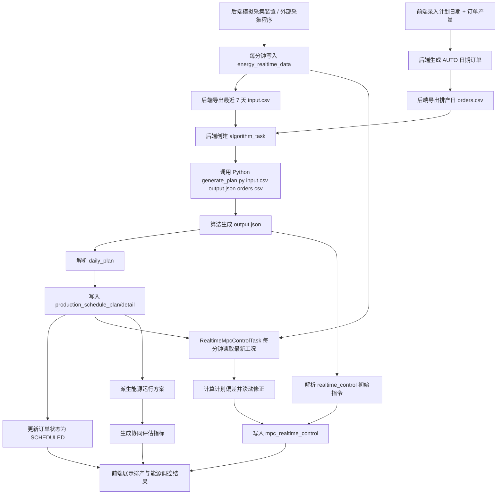
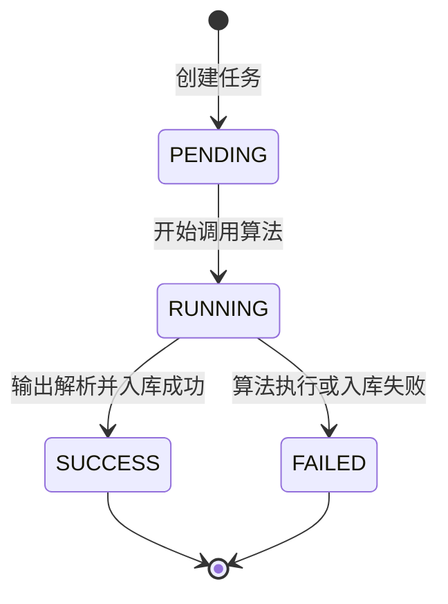

# 软件设计报告

> 项目名称：生产-能源交互式优化平台  
> 版本：v1.2  
> 整理日期：2026-08-08

## 1. 设计概述

本系统面向工业园区轧钢生产与能源供给协同优化场景，围绕“订单驱动的日级生产排产方案 + 实时能源运行方案”的一体化生成进行设计。当前版本将能源数据接入方式调整为后端模拟采集装置或外部采集程序按分钟写入 `energy_realtime_data`，前端正式流程不再上传能源 CSV。调度人员在前端录入次日计划日期和订单产量后，后端从数据库读取最近 7 天能源时序数据，导出算法输入，调用 Python 工程化算法生成小时级生产排产方案和 MPC 实时调控结果，再将结果入库并展示给前端。

当前系统已将订单表接入算法输入，但仍不是完整订单级 APS 排产系统。系统会按订单 `plannedQuantity`、`dueTime` 和 `priority` 形成当日小时需求，算法输出仍是 24 小时粒度的生产量分配，不直接生成每笔订单的独立工序路线和订单级明细。因此系统规划对象是：

```text
在给定排产日订单需求的前提下，
规划 24 小时内每小时生产多少，
并生成与该生产计划匹配的能源调控方案。
```

系统定位为：

```text
日总量约束下的小时级生产排产 + 能源运行调控协同优化系统。
```

## 2. 设计目标

- 支持用户登录、角色识别和基础权限控制。
- 支持前端录入次日计划日期和订单产量，并自动生成排产日订单输入。
- 支持后端内置模拟采集装置按分钟生成能源数据，也支持外部采集程序调用接口推送能源实时数据。
- 支持从 `energy_realtime_data` 读取最近 7 天能源数据作为算法输入；15 分钟粒度数据会插值为 1 分钟粒度。
- 支持后端异步调用 Python 算法生成 24 小时生产排产方案。
- 支持生成锅炉负荷、汽机出力、外购电等实时能源调控结果。
- 支持排产方案、能源方案、MPC 调控、协同评估和报表展示。
- 支持算法任务状态追踪，保存算法输入、输出和异常信息，便于复现与答辩说明。
- 保留 MATLAB 原型作为旧版兜底，但默认部署和联调使用 Python 算法。

## 3. 系统流程图

### 3.1 主业务流程



### 3.2 算法任务状态流程



## 4. 技术架构

### 4.1 技术栈

| 类型 | 技术 |
| --- | --- |
| 后端语言 | Java 17 |
| 后端框架 | Spring Boot 3.2.7 |
| ORM | MyBatis-Plus 3.5.7 |
| 数据库 | MySQL 8.0 |
| 数据源 | Druid |
| JSON | Fastjson2 / Jackson |
| 接口文档 | Knife4j / OpenAPI |
| 构建工具 | Maven |
| 算法运行时 | Python 3.10+ |
| 旧版算法兜底 | MATLAB |

### 4.2 后端模块设计

| 模块 | 职责 |
| --- | --- |
| `AI-common` | 统一返回结构、业务异常、状态常量、JWT 工具 |
| `AI-model` | Entity、DTO、VO 数据模型 |
| `AI-mapper` | MyBatis-Plus Mapper 与 SQL 查询 |
| `AI-service` | 生产排产、能源方案、MPC、协同评估等业务逻辑 |
| `AI-web` | Spring Boot 启动类、Controller、拦截器、全局异常、配置 |

### 4.3 数据采集设计

当前没有真实现场服务器和采集接口，因此后端提供内置模拟采集装置：

| 组件 | 职责 |
| --- | --- |
| `MockEnergyDeviceTask` | Spring 定时任务，默认启动时补齐 7 天分钟级能源数据，之后每分钟写入一条模拟采集数据 |
| `EnergyDataService.pushRealtime` | 接收模拟装置或外部采集程序推送的能源点位并写入 `energy_realtime_data` |
| `POST /api/energy/realtime/push` | 外部采集程序推送入口 |
| `POST /api/energy/realtime/mock` | 手动生成一条当前分钟模拟能源数据 |
| `RealtimeMpcControlTask` | 每分钟读取最新采集点、日级排产计划和上一轮控制指令，写入滚动 MPC 修正结果 |

真实现场接入时，可关闭 `MOCK_DEVICE_ENABLED`，由外部采集程序按分钟调用 `/api/energy/realtime/push`。

### 4.4 分层结构

```text
Controller 层：接收前端请求，完成参数接收和基础校验
Service 层：处理业务逻辑、算法调用、任务状态流转和方案入库
Mapper 层：操作 MySQL 数据库
Model 层：维护 Entity / DTO / VO 数据结构
Common 层：统一响应、异常处理、鉴权和公共工具
```

## 5. 功能模块设计

### 5.1 登录与系统管理

系统管理模块提供登录、用户信息、角色、系统配置和操作日志能力。接口采用 JWT 认证，除登录和接口文档外，业务接口默认需要携带 Token。

| 接口 | 说明 |
| --- | --- |
| `POST /api/auth/login` | 用户登录 |
| `GET /api/auth/userinfo` | 获取当前用户信息 |
| `POST /api/auth/logout` | 退出登录 |
| `GET /api/system/users` | 用户列表 |
| `GET /api/system/roles` | 角色列表 |
| `GET /api/system/logs` | 操作日志 |

### 5.2 首页看板

首页看板展示生产、能源、告警和优化指标概览，用于快速判断系统运行状态。

| 接口 | 说明 |
| --- | --- |
| `GET /api/dashboard/overview` | 首页概览 |

### 5.3 生产排产模块

生产排产模块负责订单驱动的日内小时级排产方案生成与展示。正式前端流程中，调度人员只录入 `scheduleDate` 和 `plannedQuantity`，后端自动生成或更新一条 `AUTO-计划日期` 订单，再从 `energy_realtime_data` 导出最近 7 天能源数据作为 Python 算法输入。

核心输入：

| 字段 | 说明 |
| --- | --- |
| `scheduleDate` | 计划日期，格式 `yyyy-MM-dd` |
| `plannedQuantity` | 次日订单产量，单位默认吨 |
| `productName` | 可选产品名称，不填时默认为“次日轧钢计划” |
| `energy_realtime_data` | 后端已采集能源时序数据，默认读取最近 7 天 |

主要接口：

| 接口 | 说明 |
| --- | --- |
| `GET /api/production/orders` | 生产订单列表 |
| `POST /api/production/orders/import` | 上传订单 CSV，写入或更新订单表 |
| `POST /api/production/schedules/generate-from-collected-data` | 使用已采集能源数据和前端录入产量生成方案 |
| `POST /api/production/schedules/generate-from-raw-data` | 补录/联调用：上传能源 CSV 并调用算法生成方案 |
| `POST /api/production/schedules/import-daily-plan` | 导入算法排产 JSON，作为兜底入口 |
| `GET /api/production/schedules/{scheduleId}` | 查询排产方案详情 |
| `GET /api/production/schedule/history` | 查询排产历史 |
| `POST /api/production/schedules/compare` | 排产方案对比 |

输出结果：

- 1 条排产方案主记录。
- 24 条小时级排产明细。
- EC、ER、MAPE 等评价指标。
- 与排产方案关联的能源运行方案和协同评估结果。

### 5.4 能源运行模块

能源运行模块负责展示历史能源数据、能源运行方案、设备状态、能源趋势和碳减排数据。当指定日期存在能源时序数据时，系统按小时聚合生成能源方案；当没有对应时序数据时，系统可根据排产明细派生能源方案。

| 接口 | 说明 |
| --- | --- |
| `GET /api/energy/realtime` | 实时能源数据 |
| `POST /api/energy/realtime/push` | 推送能源实时采集数据 |
| `POST /api/energy/realtime/mock` | 手动生成一条模拟能源数据 |
| `POST /api/energy/plan/generate` | 生成能源运行方案 |
| `GET /api/energy/plan/{planDate}` | 查询能源方案 |
| `GET /api/energy/plans/history` | 能源方案历史 |
| `GET /api/energy/device-status` | 设备状态 |
| `GET /api/energy/consumption-trend` | 能耗趋势 |

### 5.5 MPC 实时调控模块

MPC 模块展示实时能源调控指令，包括锅炉负荷、汽机出力、外购电、功率因数目标和未来 5 分钟预测。方案生成时，算法输出的 `realtime_control` 会作为初始调控指令入库；系统运行过程中，`RealtimeMpcControlTask` 每分钟读取最新能源采集点、当前小时日级排产计划和上一轮控制指令，计算实际负荷与计划负荷偏差，并向 `mpc_realtime_control` 写入新的滚动修正指令，从而形成“计划-执行-反馈-修正”的闭环。

| 接口 | 说明 |
| --- | --- |
| `GET /api/realtime-control/latest` | 最新 MPC 调控记录 |
| `GET /api/realtime-control/history` | MPC 历史记录 |
| `POST /api/realtime-control/tick` | 手动执行一次滚动 MPC 修正 |
| `POST /api/realtime-control/import` | 导入实时调控 JSON |

约束范围：

| 指标 | 范围 |
| --- | --- |
| 锅炉负荷 | `20-80 MW` |
| 汽机出力 | `5-30 MW` |
| 功率因数目标 | `0.95` |

### 5.6 协同评估模块

协同评估模块用于判断生产排产方案和能源运行方案的匹配程度，并输出 MAPE、仿真精度、EC 降低率、ER 可执行率等指标。

| 接口 | 说明 |
| --- | --- |
| `POST /api/optimize/joint/generate` | 生成协同评估 |
| `GET /api/optimize/joint/{optimizeId}` | 协同评估详情 |
| `GET /api/optimize/tasks` | 协同评估任务列表 |
| `GET /api/optimize/conflicts` | 约束冲突列表 |
| `GET /api/optimize/evaluation/{optimizeId}` | 协同评估指标 |

### 5.7 报表与数据分析模块

报表模块展示优化效果、能源分析、能源趋势和碳减排结果，并支持 CSV 导出。数据分析模块展示能源变量之间的相关性，辅助解释历史能源数据特征。

| 接口 | 说明 |
| --- | --- |
| `GET /api/reports/optimization-effect` | 优化效果 |
| `GET /api/reports/energy-analysis` | 能源分析 |
| `GET /api/reports/energy-trend` | 能源趋势 |
| `GET /api/reports/carbon-reduction` | 碳减排 |
| `GET /api/analysis/correlation` | 相关性分析 |

## 6. 界面设计

系统前端建议按业务角色组织页面：

| 页面 | 主要内容 |
| --- | --- |
| 登录页 | 账号、密码、登录按钮 |
| 首页看板 | 生产任务、能源负荷、EC、ER、告警概览 |
| 生产排产 | 录入计划日期和订单产量、查看任务状态、展示小时级排产 |
| 能源运行 | 能源曲线、能源方案、设备状态、能耗趋势 |
| MPC 调控 | 最新调控指令、历史调控记录、设备约束状态 |
| 协同评估 | 方案匹配度、冲突记录、EC/ER/MAPE 指标 |
| 报表中心 | 优化效果、能源分析、碳减排趋势、导出 |
| 系统管理 | 用户、角色、系统配置、操作日志 |

生产排产页面建议使用“订单驱动的小时级排产”表述，避免承诺完整订单级 APS，建议文案为：

```text
录入次日计划日期和订单产量，系统将基于已采集能源数据生成小时级生产-能源协同优化方案。
```

## 7. 人机交互逻辑设计

### 7.1 已采集数据生成方案交互

1. 用户进入生产排产页面。
2. 选择或填写次日计划日期。
3. 填写次日订单产量。
4. 点击“生成优化方案”。
5. 前端收到 `taskId` 后轮询任务状态。
6. 任务成功后读取 `resultId`。
7. 前端根据 `resultId` 查询排产详情并展示结果。

推荐接口调用顺序：

```text
POST /api/production/schedules/generate-from-collected-data
GET  /api/tasks/{taskId}
GET  /api/production/schedules/{resultId}
```

### 7.2 异常提示

| 场景 | 前端提示 |
| --- | --- |
| 计划日期为空 | 请选择次日计划日期 |
| 订单产量为空或小于等于 0 | 请填写有效的订单产量 |
| 采集数据不足 | 能源采集数据不足，至少需要最近 7 天历史数据 |
| 模拟装置未启用 | 请检查 `MOCK_DEVICE_ENABLED` 或外部采集程序是否正常推送 |
| 算法失败 | 展示任务错误信息，并保留重试入口 |

## 8. 接口设计

### 8.1 统一响应格式

```json
{
  "code": 200,
  "message": "success",
  "data": {}
}
```

### 8.2 生成方案接口

```http
POST /api/production/schedules/generate-from-collected-data
Content-Type: application/json
```

请求字段：

| 字段 | 类型 | 必填 | 说明 |
| --- | --- | --- | --- |
| `scheduleDate` | string | 是 | 计划日期，例如 `2026-08-08` |
| `plannedQuantity` | number | 是 | 次日订单产量，单位默认吨 |
| `productName` | string | 否 | 产品名称，不传时默认为“次日轧钢计划” |

请求示例：

```json
{
  "scheduleDate": "2026-08-08",
  "plannedQuantity": 1200,
  "productName": "热轧卷板"
}
```

算法调用前，后端会自动生成或更新 `AUTO-计划日期` 订单，从 `energy_realtime_data` 导出最近 7 天能源数据到任务目录下的 `input.csv`，并按排产日订单导出 `orders.csv`，随后调用：

```text
python generate_plan.py input.csv output.json orders.csv
```

响应示例：

```json
{
  "code": 200,
  "message": "已使用采集能源数据创建算法任务",
  "data": {
    "taskId": 2084186543643176962,
    "status": "PENDING",
    "progress": 0
  }
}
```

### 8.3 能源采集推送接口

```http
POST /api/energy/realtime/push
Content-Type: application/json
```

请求示例：

```json
{
  "timestamp": "2026-08-08 10:30:00",
  "elec": 720.5,
  "steam": 4.52,
  "source": "MOCK_DEVICE"
}
```

该接口用于外部模拟采集程序或真实采集适配器按分钟推送能源数据。没有现场接口时，后端内置模拟采集装置会自动调用同一套入库逻辑。

### 8.4 上传订单接口

```http
POST /api/production/orders/import
Content-Type: multipart/form-data
```

请求字段：

| 字段 | 类型 | 必填 | 说明 |
| --- | --- | --- | --- |
| `file` | file | 是 | 订单 CSV 文件 |

CSV 字段：

| 字段 | 必填 | 说明 |
| --- | --- | --- |
| `orderNo` / `order_no` | 是 | 订单编号，作为去重更新依据 |
| `productName` / `product_name` | 是 | 产品名称 |
| `plannedQuantity` / `planned_quantity` | 是 | 计划数量，单位默认吨 |
| `dueTime` / `due_time` / `deadline` | 是 | 交付时间 |
| `productSpec` / `product_spec` | 否 | 产品规格 |
| `unit` | 否 | 单位，默认 `t` |
| `priority` | 否 | 优先级，默认 `1` |
| `status` | 否 | 状态，默认 `PENDING` |
| `remark` | 否 | 备注 |

当前订单上传接口用于订单导入和算法排产输入。Python 算法按订单 `dueTime` 将 `plannedQuantity` 累加到 24 小时需求桶中，并在方案成功入库后将参与排产的订单状态更新为 `SCHEDULED`。系统当前仍不是完整订单级 APS，不直接生成每笔订单的独立工序路线。

响应示例：

```json
{
  "code": 200,
  "message": "订单导入成功",
  "data": {
    "totalCount": 3,
    "insertedCount": 2,
    "updatedCount": 1,
    "skippedCount": 0
  }
}
```

### 8.5 算法输出格式

算法输出 `output.json` 顶层包含：

```json
{
  "daily_plan": {},
  "realtime_control": {}
}
```

`daily_plan.schedule` 固定为 24 条小时记录，`realtime_control` 保存当前调控指令。

## 9. 数据库设计

核心表设计如下：

| 表名 | 说明 |
| --- | --- |
| `algorithm_task` | 算法任务记录，保存任务状态、输入、输出和错误信息 |
| `production_schedule_plan` | 排产方案主表 |
| `production_schedule_detail` | 24 小时排产明细 |
| `energy_realtime_data` | 能源时序数据 |
| `steel_energy_dataset` | 钢铁能源样本数据 |
| `energy_plan` | 能源运行方案主表 |
| `energy_plan_detail` | 能源运行方案小时明细 |
| `mpc_realtime_control` | MPC 实时调控结果 |
| `joint_optimization_plan` | 协同评估主表 |
| `constraint_conflict` | 约束冲突记录 |
| `evaluation_metric` | 评价指标 |
| `sys_user` / `sys_role` | 用户和角色 |
| `sys_operation_log` | 操作日志 |

数据流转关系：

```text
algorithm_task
    -> production_schedule_plan
    -> production_schedule_detail
    -> energy_plan / energy_plan_detail
    -> joint_optimization_plan / evaluation_metric

output.json.realtime_control
    -> mpc_realtime_control 初始指令

energy_realtime_data 最新采集点
    + production_schedule_detail 当前小时计划
    + mpc_realtime_control 上一轮指令
    -> RealtimeMpcControlTask
    -> mpc_realtime_control 分钟级滚动修正指令
```

## 10. 部署设计

默认运行配置：

| 配置 | 默认值 |
| --- | --- |
| 后端端口 | `8080` |
| 数据库 | `challenge_cup_energy` |
| 算法运行时 | `python` |
| 算法脚本 | `data/algorithm/generate_plan.py` |
| 算法任务目录 | `target/algorithm-tasks` |
| 上传文件限制 | `50MB` |
| 算法训练窗口 | `7` 天 |
| 模拟采集装置 | 默认启用 |

新增模拟采集配置：

| 配置 | 默认值 | 说明 |
| --- | --- | --- |
| `MOCK_DEVICE_ENABLED` | `true` | 是否启用后端内置模拟采集装置 |
| `MOCK_DEVICE_INTERVAL_MS` | `60000` | 定时写入间隔，默认 1 分钟 |
| `MOCK_DEVICE_BACKFILL_ON_STARTUP` | `true` | 启动时是否自动补齐历史数据 |
| `MOCK_DEVICE_BACKFILL_DAYS` | `7` | 启动时补齐最近几天数据 |
| `ALGORITHM_TRAINING_DAYS` | `7` | 后端导出给算法的历史能源窗口 |
| `REALTIME_MPC_ENABLED` | `true` | 是否启用分钟级滚动 MPC |
| `REALTIME_MPC_INTERVAL_MS` | `60000` | MPC 滚动修正间隔，默认 1 分钟 |
| `REALTIME_MPC_INITIAL_DELAY_MS` | `12000` | 后端启动后首次执行 MPC 的延迟 |

启动命令：

```powershell
cd D:\桌面\挑战杯\AI-challenge
mvn -pl AI-web -am spring-boot:run
```

## 11. 测试与验证

验证命令：

```powershell
mvn -q -DskipTests compile
```

联调验证项：

- 登录接口可返回 Token。
- 模拟采集装置启动后可写入 `energy_realtime_data`。
- 前端录入计划日期和订单产量后生成 `algorithm_task`。
- 任务成功后返回 `resultId`。
- 排产详情包含 24 条小时级记录。
- MPC 定时任务可基于最新采集点持续写入滚动调控结果。
- MPC 最新调控结果可查询。
- 协同评估显示 EC、ER、MAPE 等指标。

## 12. 后续优化方向

- 进一步扩展订单级 APS：为排产明细关联 `order_id`，生成每笔订单的工序路线和生产时间窗。
- 在算法中加入更严格的交货窗口、订单优先级和产线能力约束。
- 将能源价格、设备能力、蒸汽成本等参数从代码常量迁移到系统配置。
- 引入更严格的 MILP 求解器，例如 OR-Tools、SciPy 或 PuLP。
- 用真实企业产线、设备和订单数据替换当前联调演示数据。
## 2026-08-10 实时数据与能源方案链路修正

本版本针对“实时数据为正弦模拟”和“能源方案由 Java 固定比例派生”的差距完成代码修正。没有真实现场接口时，内置采集装置默认以 `MOCK_DEVICE_MODE=replay` 从 `data/algorithm/steel_data_cleaned.csv` 回放历史能源样本，按分钟写入 `energy_realtime_data`；该机制用于替代原默认正弦模拟，正弦逻辑仅作为样本文件不可用时的兜底。日规划算法 `generate_plan.py` 的 `output.json` 现包含 `daily_plan`、`energy_plan` 和 `realtime_control` 三部分，其中 `energy_plan` 是能源侧运行方案主来源，后端导入时优先写入 `energy_plan` / `energy_plan_detail`，Java 规则派生仅保留为无算法能源方案时的展示兜底。
