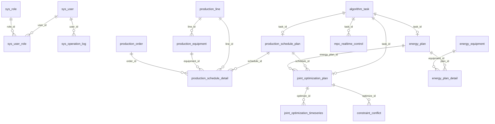

# 生产-能源交互式优化平台后端数据库设计文档（讨论稿）

> 适用项目：挑战杯“AI 赋能降本增效——创新型生产-能源交互式优化技术”  
> 适用对象：前端组、后端组、算法建模组  
> 版本：v0.4 讨论稿  
> 数据库建议：MySQL 8.0，后期实时数据量较大时可对时序数据分表或迁移时序数据库。

---

## 1. 设计目标

数据库需要支撑四类核心能力：

1. 前端页面展示：订单、方案、实时曲线、报表、告警。
2. 后端任务管理：任务创建、状态流转、失败重试、结果追溯。
3. 算法数据输入：生产订单、产线设备、能源设备、历史生产能耗数据。
4. 算法结果保存：排产方案、能源方案、协同优化结果、MAPE/EC/ER 指标。

本文件是讨论稿，字段以“能支撑接口和算法联调”为优先，不追求一次性覆盖所有正式生产系统细节。

---

## 2. 当前数据报告摘要

根据 `数据报告.txt`，当前可用数据来自 GitHub `steel-industry-energy-dataset`。

| 项目 | 内容 |
|---|---|
| 数据粒度 | 15 分钟/点 |
| 总记录数 | 35040 |
| 缺失值数量 | 0 |
| 数据完整率 | 100% |
| 用电量平均值 | 27.39 kWh |
| 用电量中位数 | 4.57 kWh |
| 用电量最大值 | 157.18 kWh |
| 用电量最小值 | 0.00 kWh |
| 用电量标准差 | 33.44 kWh |

数据报告显示时间范围为 `11-Jul-0018` 到 `12-Dec-2018 23:45:00`，持续天数显示异常。后端入库前需要对 `timestamp` 做日期清洗，并和算法组确认原始数据真实起止时间。

### 2.1 数据集字段映射

| 源字段 | 建议数据库字段 | 类型 | 说明 |
|---|---|---|---|
| `timestamp` | `timestamp` / `raw_timestamp` | datetime / varchar | 解析后时间 / 原始时间文本 |
| `elec` | `electricity_consumption` | decimal | 15 分钟用电量，kWh |
| `steam` | `steam_consumption` | decimal | 蒸汽用量，单位需确认 |
| `CO2_tCO2_` | `carbon_emission_tco2` | decimal | 碳排放，tCO2 |
| `Lagging_Current_Reactive_Power_kVarh` | `lagging_reactive_power_kvarh` | decimal | 滞后无功电量 |
| `Leading_Current_Reactive_Power_kVarh` | `leading_reactive_power_kvarh` | decimal | 超前无功电量 |
| `Lagging_Current_Power_Factor` | `lagging_power_factor` | decimal | 滞后功率因数 |
| `Leading_Current_Power_Factor` | `leading_power_factor` | decimal | 超前功率因数 |
| `NSM` | `nsm` | int | 日内秒数 |
| `week_status` | `week_status` | varchar | 工作日/周末 |
| `Day_of_week` | `day_of_week` | varchar | 星期 |
| `load_type` | `load_type` | varchar | 负荷类型 |

当前数据集缺少 `steel_output`、`qualified_output`、`energy_cost`、设备状态、订单排产等字段。EC、ER、生产排产效果和成本节约指标需要算法组补充数据、后端造 Mock 数据，或由三方约定计算/模拟口径。

### 2.2 日级排产结果文件 `daily_plan.json`

算法组已提供日级生产排产结果文件，字段如下：

| JSON 字段 | 建议数据库字段 | 说明 |
|---|---|---|
| `timestamp` | `plan_start_time` | 计划开始时间 |
| `plan_horizon` | `plan_horizon` | 计划跨度，当前为 24 |
| `unit` | `plan_unit` | 跨度单位，当前为 `hour` |
| `data_granularity` | `data_granularity` | 模型底层数据粒度，当前为 `1 minute` |
| `elec_coefficient` | `elec_coefficient` | 电耗系数，当前为 14.00 kWh/吨 |
| `total_demand` | `total_demand` | 总需求 |
| `total_energy` | `total_energy` | 总预测电耗，kWh |
| `schedule[].hour` | `hour_index` | 小时序号，0-23 |
| `schedule[].demand` | `demand` | 小时需求 |
| `schedule[].production` | `production` | 小时排产量，吨 |
| `schedule[].elec_forecast` | `elec_forecast` | 小时预测电耗，kWh |

后端建议将完整 `daily_plan.json` 原文保存在 `algorithm_task.algorithm_response_json`，同时拆分写入 `production_schedule_plan` 和 `production_schedule_detail`。

---

## 3. 通用约定

### 3.1 命名规则

| 类型 | 规则 | 示例 |
|---|---|---|
| 表名 | 小写下划线 | `production_order` |
| 字段名 | 小写下划线 | `planned_quantity` |
| 主键 | `id`，bigint | `id bigint` |
| 时间字段 | datetime | `create_time` |
| 状态字段 | varchar(32) | `status` |
| JSON 字段 | json 或 longtext | `request_json` |

### 3.2 通用字段

业务主表建议包含：

| 字段名 | 类型 | 说明 |
|---|---|---|
| `id` | bigint | 主键 |
| `create_time` | datetime | 创建时间 |
| `update_time` | datetime | 更新时间 |
| `create_by` | bigint | 创建人 ID |
| `update_by` | bigint | 更新人 ID |
| `deleted` | tinyint | 逻辑删除，0 未删除，1 已删除 |
| `remark` | varchar(500) | 备注 |

### 3.3 状态枚举

任务和方案状态建议统一：

| 状态值 | 含义 |
|---|---|
| `PENDING` | 待执行 |
| `RUNNING` | 执行中 |
| `SUCCESS` | 执行成功 |
| `FAILED` | 执行失败 |
| `CANCELED` | 已取消 |
| `PUBLISHED` | 已发布 |
| `EXECUTED` | 已执行 |

---




## 4. 系统与权限表

### 4.1 用户表 `sys_user`

用于登录、权限和操作记录。

| 字段名 | 类型 | 必填 | 说明 |
|---|---|---|---|
| `id` | bigint | 是 | 用户 ID |
| `username` | varchar(64) | 是 | 登录账号 |
| `password` | varchar(255) | 是 | 加密密码 |
| `real_name` | varchar(64) | 否 | 姓名 |
| `phone` | varchar(32) | 否 | 手机号 |
| `email` | varchar(128) | 否 | 邮箱 |
| `status` | varchar(32) | 是 | `ENABLE` / `DISABLE` |
| `last_login_time` | datetime | 否 | 最近登录时间 |
| 通用字段 | - | - | create/update/deleted/remark |

索引建议：

- 唯一索引：`uk_username(username)`

### 4.2 角色表 `sys_role`

| 字段名 | 类型 | 必填 | 说明 |
|---|---|---|---|
| `id` | bigint | 是 | 角色 ID |
| `role_code` | varchar(64) | 是 | 如 `SYSTEM_ADMIN` |
| `role_name` | varchar(64) | 是 | 角色名称 |
| `status` | varchar(32) | 是 | 启用状态 |
| 通用字段 | - | - | create/update/deleted/remark |

### 4.3 用户角色关联表 `sys_user_role`

| 字段名 | 类型 | 必填 | 说明 |
|---|---|---|---|
| `id` | bigint | 是 | 主键 |
| `user_id` | bigint | 是 | 用户 ID |
| `role_id` | bigint | 是 | 角色 ID |

### 4.4 操作日志表 `sys_operation_log`

| 字段名 | 类型 | 必填 | 说明 |
|---|---|---|---|
| `id` | bigint | 是 | 主键 |
| `user_id` | bigint | 否 | 操作人 |
| `module` | varchar(64) | 否 | 模块 |
| `operation` | varchar(128) | 否 | 操作名称 |
| `request_uri` | varchar(255) | 否 | 请求地址 |
| `request_method` | varchar(16) | 否 | 请求方式 |
| `request_param` | longtext | 否 | 请求参数 |
| `result_code` | int | 否 | 响应码 |
| `error_message` | varchar(1000) | 否 | 错误信息 |
| `operation_time` | datetime | 是 | 操作时间 |

---

## 5. 生产侧数据表

### 5.1 产线表 `production_line`

| 字段名 | 类型 | 必填 | 说明 |
|---|---|---|---|
| `id` | bigint | 是 | 产线 ID |
| `line_code` | varchar(64) | 是 | 产线编码 |
| `line_name` | varchar(128) | 是 | 产线名称 |
| `max_capacity` | decimal(12,2) | 否 | 最大产能，t/h |
| `min_capacity` | decimal(12,2) | 否 | 最小产能，t/h |
| `status` | varchar(32) | 是 | `AVAILABLE` / `STOPPED` |
| 通用字段 | - | - | create/update/deleted/remark |

### 5.2 生产设备表 `production_equipment`

| 字段名 | 类型 | 必填 | 说明 |
|---|---|---|---|
| `id` | bigint | 是 | 设备 ID |
| `line_id` | bigint | 是 | 所属产线 |
| `equipment_code` | varchar(64) | 是 | 设备编码 |
| `equipment_name` | varchar(128) | 是 | 设备名称 |
| `equipment_type` | varchar(64) | 否 | 设备类型 |
| `rated_power` | decimal(12,2) | 否 | 额定功率，kW |
| `status` | varchar(32) | 是 | `AVAILABLE` / `STOPPED` / `MAINTAINING` |
| 通用字段 | - | - | create/update/deleted/remark |

索引建议：

- 普通索引：`idx_line_id(line_id)`

### 5.3 生产订单表 `production_order`

| 字段名 | 类型 | 必填 | 说明 |
|---|---|---|---|
| `id` | bigint | 是 | 订单 ID |
| `order_no` | varchar(64) | 是 | 订单编号 |
| `product_name` | varchar(128) | 是 | 产品名称 |
| `product_spec` | varchar(128) | 否 | 产品规格，待前端确认是否需要 |
| `planned_quantity` | decimal(12,2) | 是 | 计划数量，t |
| `unit` | varchar(16) | 是 | 单位，默认 t |
| `due_time` | datetime | 是 | 交付时间 |
| `priority` | int | 是 | 优先级，数值越小越优先 |
| `status` | varchar(32) | 是 | 订单状态 |
| 通用字段 | - | - | create/update/deleted/remark |

索引建议：

- 唯一索引：`uk_order_no(order_no)`
- 普通索引：`idx_due_time(due_time)`
- 普通索引：`idx_status(status)`

---

## 6. 任务管理表

### 6.1 算法任务表 `algorithm_task`

统一保存排产、能源、协同优化、实时调控任务。

| 字段名 | 类型 | 必填 | 说明 |
|---|---|---|---|
| `id` | bigint | 是 | 任务 ID，对应接口 `taskId` |
| `task_type` | varchar(64) | 是 | `PRODUCTION_SCHEDULE` / `ENERGY_PLAN` / `JOINT_OPTIMIZATION` / `REALTIME_CONTROL` / `REALTIME_MPC` |
| `status` | varchar(32) | 是 | `PENDING` / `RUNNING` / `SUCCESS` / `FAILED` |
| `progress` | int | 否 | 进度 0-100 |
| `result_id` | bigint | 否 | 结果主键，如 schedule_id / plan_id / optimize_id |
| `message` | varchar(500) | 否 | 状态说明 |
| `error_message` | varchar(1000) | 否 | 失败原因 |
| `retry_count` | int | 是 | 重试次数，默认 0 |
| `algorithm_name` | varchar(128) | 否 | 算法名称，如 `DAILY_MILP_SCHEDULE` |
| `algorithm_version` | varchar(64) | 否 | 算法版本 |
| `result_file_name` | varchar(255) | 否 | 算法结果文件名，如 `daily_plan.json` |
| `training_record_count` | int | 否 | 模型训练/拟合使用记录数，如 132481 |
| `frontend_request_json` | longtext | 否 | 前端请求原始 JSON |
| `algorithm_request_json` | longtext | 否 | 后端传给算法的原始 JSON |
| `algorithm_response_json` | longtext | 否 | 算法返回原始 JSON |
| `start_time` | datetime | 否 | 任务开始时间 |
| `finish_time` | datetime | 否 | 任务结束时间 |
| 通用字段 | - | - | create/update/deleted/remark |

索引建议：

- 普通索引：`idx_task_type_status(task_type, status)`
- 普通索引：`idx_create_time(create_time)`

后端说明：

- 前端查询 `GET /api/tasks/{taskId}` 主要来自此表。
- 建议保存原始 JSON，便于算法问题复现和答辩展示。

---

## 7. 生产排产方案表

### 7.1 排产方案主表 `production_schedule_plan`

| 字段名 | 类型 | 必填 | 说明 |
|---|---|---|---|
| `id` | bigint | 是 | 排产方案 ID |
| `task_id` | bigint | 是 | 对应算法任务 ID |
| `schedule_name` | varchar(128) | 是 | 方案名称 |
| `schedule_date` | date | 是 | 排产日期 |
| `plan_start_time` | datetime | 是 | 计划开始时间，对应 `daily_plan.timestamp` |
| `plan_horizon` | int | 是 | 计划跨度，当前为 24 |
| `plan_unit` | varchar(32) | 是 | 计划单位，当前为 `hour` |
| `data_granularity` | varchar(32) | 是 | 模型底层数据粒度，当前为 `1 minute` |
| `status` | varchar(32) | 是 | 方案状态 |
| `objective` | varchar(64) | 否 | 优化目标 |
| `elec_coefficient` | decimal(12,4) | 否 | 电耗系数，kWh/吨 |
| `total_demand` | decimal(14,6) | 否 | 总需求 |
| `total_production` | decimal(14,6) | 否 | 总排产量，可由明细汇总 |
| `total_energy` | decimal(14,6) | 否 | 总预测电耗，kWh |
| `raw_plan_json` | longtext | 否 | `daily_plan.json` 原文，可选冗余 |
| 通用字段 | - | - | create/update/deleted/remark |

索引建议：

- 普通索引：`idx_schedule_date(schedule_date)`
- 普通索引：`idx_task_id(task_id)`

### 7.2 排产方案明细表 `production_schedule_detail`

| 字段名 | 类型 | 必填 | 说明 |
|---|---|---|---|
| `id` | bigint | 是 | 明细 ID |
| `schedule_id` | bigint | 是 | 排产方案 ID |
| `hour_index` | int | 是 | 小时序号，0-23 |
| `start_time` | datetime | 是 | 小时开始时间，由 `plan_start_time + hour_index` 派生 |
| `end_time` | datetime | 是 | 小时结束时间 |
| `demand` | decimal(14,6) | 否 | 小时需求 |
| `production` | decimal(14,6) | 是 | 小时排产量，吨 |
| `elec_forecast` | decimal(14,6) | 是 | 小时预测电耗，kWh |
| `line_id` | bigint | 否 | 产线 ID，当前 JSON 未提供 |
| `equipment_id` | bigint | 否 | 设备 ID |
| `order_id` | bigint | 否 | 订单 ID，当前 JSON 未提供 |
| `equipment_load_rate` | decimal(8,2) | 否 | 设备负荷率，当前 JSON 未提供 |
| `conflict_flag` | tinyint | 是 | 是否存在冲突 |

索引建议：

- 普通索引：`idx_schedule_id(schedule_id)`
- 唯一索引：`uk_schedule_hour(schedule_id, hour_index)`
- 普通索引：`idx_schedule_time(schedule_id, start_time, end_time)`

待前端确认：

- 甘特图是否需要工序名称、颜色、冲突原因字段。
- 当前 `daily_plan.json` 未提供产线、设备、订单字段，前端如果需要甘特图泳道，需要算法组补充或后端 Mock。

---

## 8. 能源侧数据表

### 8.1 能源介质表 `energy_medium`

| 字段名 | 类型 | 必填 | 说明 |
|---|---|---|---|
| `id` | bigint | 是 | 介质 ID |
| `medium_code` | varchar(64) | 是 | 如 `ELECTRICITY`、`STEAM` |
| `medium_name` | varchar(64) | 是 | 电力、蒸汽 |
| `unit` | varchar(32) | 是 | kWh、t |
| `standard_coal_factor` | decimal(12,6) | 否 | 折标煤系数 |
| 通用字段 | - | - | create/update/deleted/remark |

### 8.2 能源设备表 `energy_equipment`

| 字段名 | 类型 | 必填 | 说明 |
|---|---|---|---|
| `id` | bigint | 是 | 设备 ID |
| `equipment_code` | varchar(64) | 是 | 设备编码 |
| `equipment_name` | varchar(128) | 是 | 设备名称 |
| `equipment_type` | varchar(64) | 是 | 如 `BOILER` |
| `min_output` | decimal(12,2) | 否 | 最小输出 |
| `max_output` | decimal(12,2) | 否 | 最大输出 |
| `efficiency` | decimal(8,4) | 否 | 效率 |
| `status` | varchar(32) | 是 | 设备状态 |
| 通用字段 | - | - | create/update/deleted/remark |

### 8.3 能源实时数据表 `energy_realtime_data`

用于前端实时曲线和算法历史数据输入。数据量较大，后期可按月分表。

| 字段名 | 类型 | 必填 | 说明 |
|---|---|---|---|
| `id` | bigint | 是 | 主键 |
| `timestamp` | datetime | 是 | 清洗后的采集时间 |
| `raw_timestamp` | varchar(64) | 否 | 原始时间文本 |
| `electricity_consumption` | decimal(14,4) | 是 | 源字段 `elec`，15 分钟用电量，kWh |
| `steam_consumption` | decimal(14,4) | 否 | 源字段 `steam`，单位待确认 |
| `carbon_emission_tco2` | decimal(14,6) | 否 | 源字段 `CO2_tCO2_`，tCO2 |
| `lagging_reactive_power_kvarh` | decimal(14,4) | 否 | 滞后无功电量 |
| `leading_reactive_power_kvarh` | decimal(14,4) | 否 | 超前无功电量 |
| `lagging_power_factor` | decimal(8,4) | 否 | 滞后功率因数 |
| `leading_power_factor` | decimal(8,4) | 否 | 超前功率因数 |
| `nsm` | int | 否 | 日内秒数 |
| `week_status` | varchar(32) | 否 | 工作日/周末 |
| `day_of_week` | varchar(32) | 否 | 星期 |
| `load_type` | varchar(64) | 否 | 负荷类型 |
| `data_quality` | varchar(32) | 否 | `NORMAL` / `MISSING` / `ABNORMAL` |
| `source` | varchar(128) | 否 | 数据来源，默认 `steel-industry-energy-dataset` |

索引建议：

- 唯一索引：`uk_timestamp(timestamp)`
- 普通索引：`idx_data_quality(data_quality)`
- 普通索引：`idx_load_type(load_type)`
- 普通索引：`idx_week_day(week_status, day_of_week)`

### 8.4 钢铁能源样本表 `steel_energy_dataset`

用于完整保存 `数据报告.txt` 对应原始数据集字段。若不想重复建表，也可以直接用 `energy_realtime_data` 承载该数据；这里单独列出是为了导入、清洗、算法训练更清晰。

| 字段名 | 类型 | 必填 | 源字段 | 说明 |
|---|---|---|---|---|
| `id` | bigint | 是 | - | 主键 |
| `timestamp` | datetime | 是 | `timestamp` | 清洗后的时间 |
| `raw_timestamp` | varchar(64) | 否 | `timestamp` | 原始时间文本 |
| `electricity_consumption` | decimal(14,4) | 是 | `elec` | 用电量，kWh |
| `lagging_reactive_power_kvarh` | decimal(14,4) | 否 | `Lagging_Current_Reactive_Power_kVarh` | 滞后无功电量 |
| `leading_reactive_power_kvarh` | decimal(14,4) | 否 | `Leading_Current_Reactive_Power_kVarh` | 超前无功电量 |
| `carbon_emission_tco2` | decimal(14,6) | 否 | `CO2_tCO2_` | 碳排放，tCO2 |
| `lagging_power_factor` | decimal(8,4) | 否 | `Lagging_Current_Power_Factor` | 滞后功率因数 |
| `leading_power_factor` | decimal(8,4) | 否 | `Leading_Current_Power_Factor` | 超前功率因数 |
| `nsm` | int | 否 | `NSM` | 日内秒数 |
| `week_status` | varchar(32) | 否 | `week_status` | 工作日/周末 |
| `day_of_week` | varchar(32) | 否 | `Day_of_week` | 星期 |
| `load_type` | varchar(64) | 否 | `load_type` | 负荷类型 |
| `steam_consumption` | decimal(14,4) | 否 | `steam` | 蒸汽用量，单位待确认 |
| `data_quality` | varchar(32) | 否 | - | 数据质量 |

索引建议：

- 唯一索引：`uk_timestamp(timestamp)`
- 普通索引：`idx_load_type(load_type)`
- 普通索引：`idx_nsm(nsm)`

待算法组确认：

- `steam` 字段单位是否为 t。
- `timestamp` 起始年份异常如何修正。
- 是否需要根据 `elec` 派生平均电力负荷，口径是否为 `elec * 4`。
- 是否需要额外补充生产产量、合格产量和电价，当前数据集无法直接计算 EC、ER 和能源成本。

### 8.5 生产能源历史表 `energy_production_history`

用于后续融合生产数据和能源数据。当前数据集暂时不能完整填充此表，需补充或模拟生产产量字段。

| 字段名 | 类型 | 必填 | 单位 | 说明 |
|---|---|---|---|---|
| `id` | bigint | 是 | - | 主键 |
| `timestamp` | datetime | 是 | - | 时间，建议按 15 分钟对齐 |
| `steel_output` | decimal(14,2) | 否 | t | 轧钢产量，当前数据集缺失 |
| `qualified_output` | decimal(14,2) | 否 | t | 合格产品产量，当前数据集缺失 |
| `electricity_consumption` | decimal(14,4) | 是 | kWh | 用电量，来自 `elec` |
| `steam_consumption` | decimal(14,4) | 否 | 待确认 | 蒸汽用量，来自 `steam` |
| `carbon_emission_tco2` | decimal(14,6) | 否 | tCO2 | 碳排放 |
| `energy_cost` | decimal(14,2) | 否 | 元 | 能源成本，需由电价和用能量派生 |
| `load_type` | varchar(64) | 否 | - | 负荷类型 |
| `data_quality` | varchar(32) | 否 | - | 数据质量 |

---

## 9. 能源运行方案表

### 9.1 能源运行方案主表 `energy_plan`

| 字段名 | 类型 | 必填 | 说明 |
|---|---|---|---|
| `id` | bigint | 是 | 能源方案 ID |
| `task_id` | bigint | 是 | 对应算法任务 ID |
| `plan_date` | date | 是 | 方案日期 |
| `status` | varchar(32) | 是 | 方案状态 |
| `objective` | varchar(64) | 否 | 优化目标 |
| `electric_price_mode` | varchar(64) | 否 | 电价模式 |
| `time_interval` | int | 是 | 时间粒度，当前数据集为 15 min |
| `electricity_cost` | decimal(14,2) | 否 | 电力成本，需由电价派生 |
| `steam_cost` | decimal(14,2) | 否 | 蒸汽成本，需由蒸汽单价派生 |
| `total_energy_cost` | decimal(14,2) | 否 | 总能源成本，派生字段 |
| 通用字段 | - | - | create/update/deleted/remark |

### 9.2 能源运行方案明细表 `energy_plan_detail`

| 字段名 | 类型 | 必填 | 说明 |
|---|---|---|---|
| `id` | bigint | 是 | 明细 ID |
| `plan_id` | bigint | 是 | 能源方案 ID |
| `timestamp` | datetime | 是 | 时间点 |
| `equipment_id` | bigint | 否 | 能源设备 ID |
| `output` | decimal(14,2) | 否 | 设备输出 |
| `electricity_consumption` | decimal(14,4) | 否 | 用电量，kWh |
| `steam_consumption` | decimal(14,4) | 否 | 蒸汽用量，单位待确认 |
| `carbon_emission_tco2` | decimal(14,6) | 否 | 碳排放，tCO2 |
| `energy_cost` | decimal(14,2) | 否 | 能源成本，派生字段 |

索引建议：

- 普通索引：`idx_plan_time(plan_id, timestamp)`

---

## 10. 协同优化表

### 10.1 协同优化方案主表 `joint_optimization_plan`

| 字段名 | 类型 | 必填 | 说明 |
|---|---|---|---|
| `id` | bigint | 是 | 协同优化方案 ID |
| `task_id` | bigint | 是 | 对应算法任务 ID |
| `schedule_id` | bigint | 是 | 排产方案 ID |
| `energy_plan_id` | bigint | 是 | 能源方案 ID |
| `status` | varchar(32) | 是 | 方案状态 |
| `recommended` | tinyint | 是 | 是否推荐方案 |
| `cost_reduction_rate` | decimal(8,2) | 否 | 降本率，% |
| `energy_reduction_rate` | decimal(8,2) | 否 | 降耗率，% |
| `execute_rate` | decimal(8,2) | 否 | 可执行率，% |
| `mape` | decimal(8,2) | 否 | 仿真误差，% |
| `ec` | decimal(12,4) | 否 | 单位合格产品能耗 |
| `er` | decimal(8,2) | 否 | 方案可执行率，% |
| 通用字段 | - | - | create/update/deleted/remark |

### 10.2 协同优化时序明细表 `joint_optimization_timeseries`

| 字段名 | 类型 | 必填 | 说明 |
|---|---|---|---|
| `id` | bigint | 是 | 明细 ID |
| `optimize_id` | bigint | 是 | 协同优化方案 ID |
| `timestamp` | datetime | 是 | 时间点 |
| `planned_output` | decimal(14,2) | 否 | 计划产量，t |
| `electricity_consumption` | decimal(14,4) | 否 | 用电量，kWh |
| `steam_consumption` | decimal(14,4) | 否 | 蒸汽用量，单位待确认 |
| `carbon_emission_tco2` | decimal(14,6) | 否 | 碳排放，tCO2 |
| `energy_cost` | decimal(14,2) | 否 | 能源成本，派生字段 |

索引建议：

- 普通索引：`idx_optimize_time(optimize_id, timestamp)`

### 10.3 约束冲突记录表 `constraint_conflict`

| 字段名 | 类型 | 必填 | 说明 |
|---|---|---|---|
| `id` | bigint | 是 | 冲突 ID |
| `optimize_id` | bigint | 是 | 协同优化方案 ID |
| `conflict_type` | varchar(64) | 是 | 冲突类型 |
| `start_time` | datetime | 是 | 开始时间 |
| `end_time` | datetime | 是 | 结束时间 |
| `description` | varchar(1000) | 否 | 冲突说明 |
| `resolved` | tinyint | 是 | 是否解决 |

### 10.4 评价指标记录表 `evaluation_metric`

用于保存 MAPE、EC、ER 和优化前后对比指标。

| 字段名 | 类型 | 必填 | 说明 |
|---|---|---|---|
| `id` | bigint | 是 | 指标 ID |
| `biz_type` | varchar(64) | 是 | `SCHEDULE` / `ENERGY` / `JOINT` |
| `biz_id` | bigint | 是 | 业务主键 |
| `mape` | decimal(8,2) | 否 | MAPE，% |
| `ec_before` | decimal(12,4) | 否 | 优化前 EC |
| `ec_after` | decimal(12,4) | 否 | 优化后 EC |
| `er` | decimal(8,2) | 否 | ER，% |
| `cost_saving` | decimal(14,2) | 否 | 降本金额，元 |
| `carbon_reduction` | decimal(14,6) | 否 | 碳减排，tCO2 |
| `calculate_time` | datetime | 是 | 指标计算时间 |

待算法组确认：

- MAPE、EC、ER 由算法直接输出，还是后端根据原始数据复算。
- EC 是否需要乘以 100%，当前建议不乘，单位为 kgce/t。

---

## 11. 实时 MPC 调控表

### 11.1 MPC 实时调控结果表 `mpc_realtime_control`

用于保存算法组每分钟更新一次的 `realtime_control.json`。前端实时调控页面查询最新记录或按时间查询历史记录。

| 字段名 | 类型 | 必填 | 说明 |
|---|---|---|---|
| `id` | bigint | 是 | 控制记录 ID |
| `task_id` | bigint | 否 | 对应算法任务 ID，可为空 |
| `control_date` | date | 是 | 控制日期，由后端按入库日期或业务日期填充 |
| `control_time` | time | 是 | 控制时间，对应 `timestamp`，格式 `HH:mm:ss` |
| `raw_timestamp` | varchar(32) | 是 | 原始时间字符串 |
| `boiler_load_mw` | decimal(14,6) | 是 | 锅炉负荷指令，MW |
| `turbine_output_mw` | decimal(14,6) | 是 | 汽机出力指令，MW |
| `grid_purchase_kwh` | decimal(14,6) | 是 | 外购电力指令，kWh |
| `power_factor_target` | decimal(8,6) | 是 | 功率因数目标值 |
| `elec_next_5min_kwh` | decimal(14,6) | 是 | 未来 5 分钟用电预测，kWh |
| `steam_next_5min_t` | decimal(14,6) | 是 | 未来 5 分钟蒸汽预测，吨 |
| `source_file_name` | varchar(255) | 否 | 来源文件名，如 `realtime_control.json` |
| `raw_json` | longtext | 否 | 原始 JSON |
| `create_time` | datetime | 是 | 入库时间 |

索引建议：

- 唯一索引：`uk_control_datetime(control_date, control_time)`，同一天同一分钟只保留一条记录。
- 普通索引：`idx_create_time(create_time)`。

后端校验：

- `control_time` 必须能由 `timestamp` 解析。
- `power_factor_target` 建议范围为 0-1。
- 锅炉负荷、汽机出力、外购电力和预测值不能为负数。

---

## 12. 报表、告警和配置表

### 12.1 告警记录表 `warning_record`

| 字段名 | 类型 | 必填 | 说明 |
|---|---|---|---|
| `id` | bigint | 是 | 告警 ID |
| `warning_type` | varchar(64) | 是 | 告警类型 |
| `level` | varchar(32) | 是 | `LOW` / `MEDIUM` / `HIGH` |
| `message` | varchar(1000) | 是 | 告警信息 |
| `biz_type` | varchar(64) | 否 | 关联业务类型 |
| `biz_id` | bigint | 否 | 关联业务 ID |
| `warning_time` | datetime | 是 | 告警时间 |
| `handled` | tinyint | 是 | 是否处理 |

### 12.2 系统配置表 `system_config`

| 字段名 | 类型 | 必填 | 说明 |
|---|---|---|---|
| `id` | bigint | 是 | 配置 ID |
| `config_key` | varchar(128) | 是 | 配置键 |
| `config_value` | varchar(1000) | 是 | 配置值 |
| `config_name` | varchar(128) | 否 | 配置名称 |
| `config_group` | varchar(64) | 否 | 配置分组 |
| `editable` | tinyint | 是 | 是否可编辑 |
| 通用字段 | - | - | create/update/deleted/remark |

### 12.3 报表统计表 `report_statistic`

如果报表直接实时查询压力较大，可定时汇总到此表。

| 字段名 | 类型 | 必填 | 说明 |
|---|---|---|---|
| `id` | bigint | 是 | 主键 |
| `stat_date` | date | 是 | 统计日期 |
| `stat_type` | varchar(64) | 是 | 统计类型 |
| `total_energy_kgce` | decimal(14,2) | 否 | 总能耗 |
| `energy_cost` | decimal(14,2) | 否 | 能源成本 |
| `cost_saving` | decimal(14,2) | 否 | 降本金额 |
| `carbon_reduction` | decimal(14,6) | 否 | 碳减排，tCO2 |
| `production_output` | decimal(14,2) | 否 | 产量 |

---

## 13. 表关系概览

```text
sys_user -> algorithm_task

steel_energy_dataset -> energy_realtime_data
steel_energy_dataset -> energy_production_history

production_line -> production_equipment
production_order -> production_schedule_detail
production_schedule_plan -> production_schedule_detail

energy_equipment -> energy_plan_detail
energy_plan -> energy_plan_detail

algorithm_task -> production_schedule_plan
algorithm_task -> energy_plan
algorithm_task -> joint_optimization_plan

production_schedule_plan -> joint_optimization_plan
energy_plan -> joint_optimization_plan
joint_optimization_plan -> joint_optimization_timeseries
joint_optimization_plan -> constraint_conflict
joint_optimization_plan -> evaluation_metric

algorithm_task -> mpc_realtime_control
```

---

## 14. 三方待确认问题

### 14.1 前端组确认

| 问题 | 影响 |
|---|---|
| 甘特图是否需要设备、工序、颜色、冲突字段 | 影响 `production_schedule_detail` 字段 |
| 实时曲线最多显示多少点 | 影响 `energy_realtime_data` 查询和聚合 |
| 方案对比最多同时对比几套 | 影响批量查询接口和索引 |
| 报表是否需要 Excel / PDF 导出 | 影响报表表和导出接口 |
| 首页是否需要趋势图 | 影响是否新增 Dashboard 趋势接口 |

### 14.2 算法组确认

| 问题 | 影响 |
|---|---|
| 历史训练数据最少需要哪些字段 | 影响 `energy_production_history` |
| 时间粒度是否统一采用 15 分钟 | 当前数据报告为 15 分钟/点，影响实时表、方案明细表数据量 |
| 是否输出 MAPE/EC/ER | 影响 `evaluation_metric` 和后端计算逻辑 |
| 是否需要保存帕累托前沿 | 可能新增 `pareto_solution` 表 |
| 算法是否输出设备启停指令 | 可能新增 `control_command` 表 |
| `daily_plan.json` 字段是否长期稳定 | 影响 `production_schedule_plan` 和 `production_schedule_detail` 正式建表 |
| 后续是否补充产线、设备、订单字段 | 影响前端甘特图和排产明细表外键 |
| MPC 实时模型输出格式 | 已按 `realtime_control.json` 新增 `mpc_realtime_control`，如字段变化需同步调整 |

### 14.3 后端组确认

| 问题 | 当前建议 |
|---|---|
| 原始 JSON 保存位置 | 先保存在 `algorithm_task` longtext 字段 |
| 实时数据存储 | 先用 MySQL，数据量大后按月分表 |
| 是否逻辑删除 | 业务主表使用 `deleted` |
| 主键生成方式 | 雪花 ID 或数据库自增均可，建议后端统一封装 |
| 是否需要建表 SQL | 三方字段确认后再生成正式 SQL |

---

## 15. 后续落地顺序

1. 三方先确认接口文档和数据库字段。
2. 后端根据本文档生成正式建表 SQL。
3. 后端搭建 Spring Boot 多模块项目。
4. 后端先实现 Mock 数据接口。
5. 前端按 Mock 接口联调页面。
6. 算法组提供固定 JSON 或 HTTP Mock 服务。
7. 后端接入真实算法和真实数据库。
